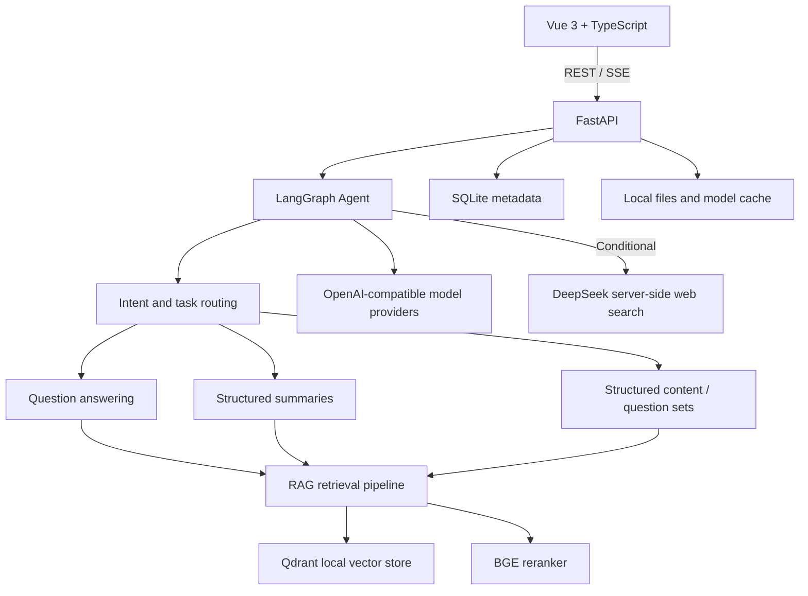

# Agentic: A General-Purpose RAG Agent Research Platform

[简体中文](README.md) | **English**

> **Repository:** [SevChu/RAG-Agent](https://github.com/SevChu/RAG-Agent) — publicly
> visible, but proprietary and not open source.
>
> **About:** A local-first RAG agent research platform built with FastAPI, Vue 3,
> LangGraph, BGE-M3, Qdrant, and multiple OpenAI-compatible model providers. Its
> long-term goal is to build a more general-purpose agent with consistently high
> answer quality through traceable retrieval, fine-tuning, and evaluation/scoring
> algorithm improvements.
>
> **License:** Copyright © 2026 Severus Chu. All rights reserved. The proprietary
> license applies only to original Agentic materials owned by Severus Chu.
> Third-party dependencies, models, and benchmark datasets remain subject to their
> respective upstream terms. See [LICENSE](LICENSE) and
> [THIRD_PARTY_NOTICES.md](THIRD_PARTY_NOTICES.md).

> **Current language boundary:** the current Agentic release provides a Chinese-only
> user interface, prompts, and user-facing error messages. This English README
> documents the project for international readers; it does not mean that the
> application itself already supports English. Product-level English support is
> planned as a future internationalization milestone.

## Quick Start for First-Time Users

> This section is for locally running the project with the author's permission.
> You do not need to understand the full architecture first: configure one model
> API, make sure the local retrieval models exist, and start the backend and frontend.

### 1. Install the Basic Tools

Windows 10/11 is recommended. Install:

- [Git](https://git-scm.com/);
- [uv](https://docs.astral.sh/uv/);
- Node.js 24 or a compatible release, including npm;
- an NVIDIA GPU is recommended. CPU execution is possible for some workflows, but
  document indexing and local-model inference will be considerably slower.

If you already have the full project directory, open PowerShell in that directory.
If you are authorized to retrieve it from GitHub:

```powershell
git clone https://github.com/SevChu/RAG-Agent.git
cd RAG-Agent
```

### 2. Create `.env` and Configure One Provider

From the repository root:

```powershell
Copy-Item .env.example .env
notepad .env
```

For the shortest initial setup, configure at least one provider. DeepSeek example:

```dotenv
LLM_BASE_URL=https://api.deepseek.com
LLM_API_KEY=replace-with-your-own-api-key
LLM_MODEL=replace-with-your-current-model-id
LLM_AVAILABLE_MODELS=replace-with-your-current-model-id
```

Use the exact model ID currently shown by your provider. Never commit `.env` or a
real API key. For Qwen, Kimi, or GLM, fill both the corresponding `*_API_KEY` and
`*_MODELS`; the provider remains disabled until both values are present.

### 3. Prepare the Local Retrieval Models

Model weights are not distributed through the GitHub repository, and Agentic does
not download them automatically. A fresh environment needs:

| Purpose | Model | Default directory |
|---|---|---|
| Embeddings and retrieval | `BAAI/bge-m3` | `data/models/embedding/bge-m3/` |
| Retrieval reranking | `BAAI/bge-reranker-v2-m3` | `data/models/reranker/bge-reranker-v2-m3/` |
| Scanned-PDF OCR | local PaddleOCR models | `data/models/paddleocr/` |

OCR may be prepared later if you initially use documents with a native text layer.
The embedding and reranker models are required for the complete RAG workflow.
Before downloading or copying any model, verify its source, license, revision, size,
and hashes. If you use different directories, update `EMBEDDING_MODEL_PATH`,
`RERANKER_MODEL_PATH`, and `PADDLE_OCR_BASE_DIR` in `.env`.

### 4. Start the Backend

Open the first PowerShell window in the repository root:

```powershell
cd backend
uv sync --frozen
uv run alembic upgrade head
uv run python -m uvicorn app.main:app --reload --host 127.0.0.1 --port 8000
```

The first `uv sync --frozen` installs the backend dependencies and may take some
time. Keep this window open after Uvicorn starts listening on
`http://127.0.0.1:8000`.

### 5. Start the Frontend

Open a second PowerShell window in the repository root:

```powershell
cd frontend
npm install
npm.cmd run dev -- --host 127.0.0.1
```

Open:

- Application: `http://127.0.0.1:5173/`
- Backend health check: `http://127.0.0.1:8000/api/health`
- OpenAPI documentation: `http://127.0.0.1:8000/docs`

### 6. Complete Your First Grounded Question

1. Open Settings and confirm that your provider is marked as configured.
2. Create a resource space.
3. Upload a PDF, PPTX, DOCX, Markdown, or TXT file.
4. Wait until the document status is complete.
5. Open Agent Chat, select the resource space, and ask a question.
6. Confirm that the answer includes file, page, slide, or section citations.

### Common Startup Problems

| Symptom | Check first |
|---|---|
| `uv` or `npm` is not recognized | Install the tool and restart the terminal |
| Backend reports a missing model directory | Compare all local model paths with `.env` |
| Provider is shown as not configured | Fill both its key and model list, then restart the backend |
| Model service cannot be reached | Base URL, model ID, API key, account quota, and network |
| Port 8000 or 5173 is already in use | Stop an older backend or frontend process |
| A scanned PDF cannot be parsed | Prepare PaddleOCR models; test TXT/Markdown first |

If the application still does not start, follow the checks in
[Operations](docs/technical/operations.md). Every environment variable is documented
in [Configuration](docs/technical/configuration.md).

## Project Status

- Latest release: `v1.2.1` — Week 6 Extra rejection evidence. The Day 2 retrieval
  candidate is rejected and Day 3 remains deferred; neither enters a profile. The
  existing offline/advisory NLI span-localization profile is unchanged.
- Functional baseline: `v1.1.0` — complete local RAG workflow, general-agent UI
  migration, FiQA/RAGTruth/RAGBench classic baselines. The local profile registry is 1.1.0.
- Runtime model providers: DeepSeek plus reserved OpenAI-compatible interfaces for
  Qwen, Kimi, and GLM.
- Deployment model: local, single-user, and local-data-first.
- Interface language: Chinese only in the current release.
- English product support: planned for `v1.6.0`; not implemented yet.

## Overview

Agentic turns documents, reports, slides, and personal notes into isolated,
searchable resource spaces. It combines retrieval-augmented generation with
traceable evidence, persistent conversations, controlled web search, reproducible
evaluation, and a roadmap for per-agent fine-tuning.

The current system can:

- import PDF, PPTX, DOCX, Markdown, and TXT files;
- parse, chunk, embed, and index local documents;
- answer questions with file, page, slide, and section citations;
- combine resource-space evidence with clearly separated external information;
- generate structured summaries and mixed question sets;
- preserve quick-chat and resource-space conversation histories separately;
- switch among configured model providers without exposing API keys to the browser;
- reproduce retrieval, hallucination-detection, and RAG-scoring benchmarks;
- export aggregate benchmark results without publishing raw datasets or predictions.

The original learning-assistant functions remain available as optional capability
templates, but the product direction is now a general-purpose agent platform.

## Architecture



### Technology Stack

| Layer | Technology |
|---|---|
| Frontend | Vue 3, TypeScript, Vite, Element Plus, Pinia |
| Backend | Python 3.11, FastAPI, Pydantic, SQLAlchemy, Alembic |
| Agent orchestration | LangGraph |
| Model providers | DeepSeek, Qwen, Kimi, and GLM through OpenAI-compatible APIs |
| Embeddings | `BAAI/bge-m3` |
| Reranking | `BAAI/bge-reranker-v2-m3` |
| Vector storage | Qdrant Local Mode |
| Metadata storage | SQLite |
| Document processing | pypdf, python-docx, python-pptx, PaddleOCR |
| Evaluation | pytest and custom reproducible benchmark runners |

## Core Workflows

### Document Ingestion

```text
File upload
→ type, size, and safety validation
→ SHA-256 duplicate detection
→ native text and layout extraction
→ page-level OCR fallback when required
→ structure-aware chunking
→ local embedding generation
→ Qdrant indexing
→ metadata and processing-status persistence
```

Documents are isolated by resource space. The current internal schema still uses
legacy `Course`, `course_id`, and `/api/courses` identifiers for backward
compatibility; the user-facing product is no longer limited to courses.

### Evidence-Grounded Answering

```text
User request
→ intent and resource-space resolution
→ query rewriting
→ dense and lexical candidate retrieval
→ reranking and evidence gating
→ answer generation with citations
→ faithfulness and citation checks
→ streamed response and conversation persistence
```

The system distinguishes local evidence, external supplementary information, and
model inference. If evidence is insufficient, it should abstain rather than present
unsupported content as fact.

### Model Provider Routing

Each provider has an independent Base URL, API key, and model allowlist. The backend
resolves the provider from the selected model ID and never sends secret keys to the
frontend. A provider remains disabled until both its API key and model list are
configured.

DeepSeek-specific reasoning and server-side web-search behavior is not automatically
assumed to exist on other OpenAI-compatible providers. When Qwen, Kimi, or GLM is
used for the final answer, web search still follows the separately configured
DeepSeek search path.

## Reproducible Evaluation

Agentic `v1.1.0` introduced three approved public-dataset baselines. Raw datasets,
per-sample predictions, model weights, and local caches are not committed.

| Task | Dataset | Current baseline | Selected result |
|---|---|---|---|
| Retrieval | BEIR FiQA | BGE-M3 Dense top-100 | nDCG@10 0.4126; Recall@100 0.7188 |
| Retrieval reranking | BEIR FiQA | RRF candidates + BGE reranker | nDCG@10 0.4299; MRR@10 0.5162 |
| Hallucination response detection | RAGTruth | Lexical coverage | F1 0.6245; AUROC 0.7248; AUPRC 0.5042 |
| Hallucination span localization | RAGTruth | Logistic fusion | Character F1 0.1777 |
| RAG trace scoring | RAGBench | Lexical + Dense linear | AUROC 0.7273; AUPRC 0.9292 |

These figures are research baselines, not production-quality guarantees. The most
important known gaps are equal-weight RRF degradation, weak hallucination-span
localization, and limited completeness correlation.

See:

- [Public benchmark summary](benchmarks/v1.1.0/README.md)
- [Evaluation and frozen baselines](docs/technical/evaluation-and-baselines.md)
- [Week 5 engineering log](docs/engineering-logs/week-05.md)

## Detailed Setup Reference

Use the [Quick Start](#quick-start-for-first-time-users) above for installation and
startup. Keep provider settings in `.env`, created from [.env.example](.env.example).
Changing provider URLs, keys, or model lists requires a backend restart; switching
among already configured models does not require a frontend restart.

For complete settings, storage, backups, and troubleshooting, see the
[Configuration reference](docs/technical/configuration.md) and
[Operations guide](docs/technical/operations.md).

## Privacy, Security, and Data Boundaries

- Uploaded documents, resource spaces, conversations, databases, and API keys must
  remain local and are excluded from Git.
- Benchmark downloads require explicit per-dataset approval.
- The repository contains only aggregate benchmark results and reproducibility
  metadata, never raw benchmark samples or per-sample predictions.
- Uploaded material is treated as untrusted data, not as system instructions.
- The first release does not execute uploaded or generated code.
- The current system is local and single-user; it does not provide accounts,
  permissions, collaboration, or public multi-tenant deployment.

## Roadmap

| Target | Planned scope | Status |
|---|---|---|
| `v1.2.0` | Evaluation governance and advisory NLI span profile | Released |
| `v1.2.1` | Week 6 Extra evidence; no new profile | Released |
| `v1.3.0` | Versioned AgentProfile and multi-agent configuration | Planned |
| `v1.4.0-beta.1` | Training dataset, job, adapter registry, and fine-tuning UI foundation | Planned beta |
| `v1.4.0` | First real scorer or reranker fine-tuning and rollback | Planned |
| `v1.5.0` | Dynamic long context, resource-space memory, and private gold-set tooling | Planned |
| `v1.6.0` | Chinese/English internationalization and bilingual quality validation | Planned |

The `v1.6.0` internationalization milestone is expected to cover:

1. locale resources and a persistent language preference;
2. English UI labels, validation messages, and operational errors;
3. locale-aware prompts and English answer-generation policies;
4. English ingestion, retrieval, citation, summarization, and conversation tests;
5. bilingual regression slices and language-isolation checks;
6. Chinese fallback behavior for untranslated or unsupported content.

English support will not be marked complete merely because an English README exists
or because the underlying model can answer in English. Product UI, backend errors,
prompt behavior, retrieval quality, and regression coverage must all pass the
internationalization acceptance gate.

See the detailed [Week 6–11 and later roadmap](docs/deliverables/week-06-to-11-roadmap.md).

## Repository Layout

```text
Agentic/
├── backend/                 FastAPI, RAG, agents, evaluation, and migrations
├── frontend/                Vue 3 web application
├── benchmarks/v1.1.0/       Aggregate public benchmark results only
├── docs/                    Technical docs, decisions, releases, and logs
├── data/                    Local-only data, models, indexes, and databases
├── .env.example             Safe configuration template
├── LICENSE                  Proprietary license for original Agentic materials
└── THIRD_PARTY_NOTICES.md   Third-party attribution and licensing boundaries
```

## Documentation

- [Technical documentation index](docs/technical/README.md)
- [System architecture](docs/technical/architecture.md)
- [Configuration reference](docs/technical/configuration.md)
- [API reference](docs/technical/api-reference.md)
- [Data and RAG pipeline](docs/technical/data-and-rag-pipeline.md)
- [Agent and generation pipeline](docs/technical/agent-and-generation.md)
- [Development and testing](docs/technical/development-and-testing.md)
- [Week 6 Extra aggregate results: v1.2.1](benchmarks/v1.2.1/README.md)
- [Release notes: v1.2.1](docs/releases/v1.2.1.md)
- [v1.2.1 data-redaction and release-security review](docs/releases/v1.2.1-security-review.md)
- [Release notes: v1.2.0](docs/releases/v1.2.0.md)
- [v1.2.0 data-redaction and release-security review](docs/releases/v1.2.0-security-review.md)
- [Release notes: v1.1.1](docs/releases/v1.1.1.md)
- [Engineering logs](docs/engineering-logs/README.md)

Most detailed technical and historical documents are currently written in Chinese.
Their English documentation migration will follow the same terminology and review
rules as the product internationalization milestone.

## License and Ownership

Agentic is publicly visible for review and demonstration, but it is not an
open-source project. You may not use, copy, modify, merge, publish, distribute,
sublicense, or sell original Agentic materials except with explicit written
permission from the copyright owner.

Third-party dependencies, models, benchmark datasets, and derived notices are not
relicensed under the Agentic proprietary license. Review
[THIRD_PARTY_NOTICES.md](THIRD_PARTY_NOTICES.md) before redistribution or research
use.

**Author and copyright owner:** Severus Chu
