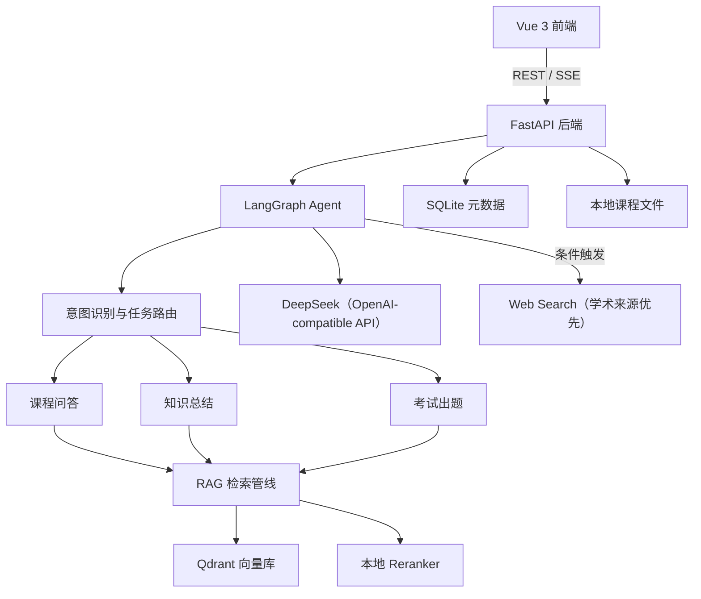

# Agentic：基于 RAG 的通用智能体实验平台

> **GitHub 仓库**：[SevChu/RAG-Agent](https://github.com/SevChu/RAG-Agent)（公开可见、非开源）
>
> **About**：基于 FastAPI、Vue 3、LangGraph、BGE-M3、Qdrant 与多模型 OpenAI 兼容接口构建的本地优先 RAG Agent 实验平台；目标是通过可追溯知识检索、模型微调与评测/评分算法优化，打造较为通用且回答质量较高的 Agent。
>
> **许可**：Copyright © 2026 Severus Chu。All rights reserved. 专有许可只覆盖 Severus Chu
> 拥有版权的 Agentic 原创材料；第三方依赖、模型与 Benchmark 不在该版权主张范围内，分别
> 遵循其上游条款。详见 [LICENSE](LICENSE) 与 [THIRD_PARTY_NOTICES](THIRD_PARTY_NOTICES.md)。

> 项目状态：`v1.1.0` 已包含完整本地 RAG 功能、通用智能体界面迁移，以及 FiQA、RAGTruth、
> RAGBench 经典基线；推荐 baseline profile 1.0.0、公开聚合结果和第 6～11 周研发路线已冻结。

## 1. 项目简介

Agentic 是一个本地优先、资料可追溯、支持评测与后续微调的通用智能体实验平台。系统通过 RAG（Retrieval-Augmented Generation，检索增强生成）技术，将文档、报告、课件和个人笔记构建为相互隔离的可检索资料空间，并在此基础上提供：

- 带资料引用的通用问答；
- 按文档、章节或主题生成资料总结；
- 信息提取、资料比较和结构化内容生成；
- 保存智能体对话和生成结果；
- 使用公开 Benchmark 与自有金标数据评测并优化检索和评分算法；
- 为每个智能体绑定独立配置、评测套件和后续微调 Adapter。

第一版仍为本地单用户系统，支持多个相互隔离的资料空间；原有学习辅导和组卷能力作为可选能力模板保留，不实现账号、权限、资料共享和在线代码执行。

## 2. 项目目标

### 2.1 功能目标

1. 支持上传 PDF、PPTX、DOCX、Markdown 和 TXT 课程资料。
2. 自动解析、分块、向量化并建立课程知识库。
3. 回答日常学科问题，并返回文件名、页码、幻灯片编号等引用。
4. 支持默认“课程资料 + 外部补充”和可选“仅课程资料”；两类来源必须明确分离和引用。
5. 生成结构化课程总结，包括重点、难点、易错点和复习建议。
6. 按知识点、题型、数量和难度生成考试题。
7. 为编程题生成题意、约束、样例、参考代码、复杂度分析和测试用例设计，但不执行代码。
8. 建立小型量化评测体系，对不同 RAG 方案进行消融实验。

### 2.2 验收目标

- 文档入库、问答、总结和出题四条主流程均可完整演示。
- 检索 `Hit@5` 达到 80% 以上。
- 改进方案相对基础 RAG 的 `Hit@5` 提升至少 10 个百分点。
- 引用正确率达到 90% 以上。
- 知识库外问题的正确拒答率达到 80% 以上。
- 建立不少于 50 条的独立评测集并输出实验报告。

## 3. 系统架构



### 3.1 技术选择

| 层级 | 技术 |
|---|---|
| 前端 | Vue 3、TypeScript、Vite、Element Plus |
| 后端 | Python 3.11、FastAPI、Pydantic |
| Agent 编排 | LangGraph |
| 大模型 | DeepSeek OpenAI-compatible API；支持通过配置切换模型 |
| Embedding | `BAAI/bge-m3` |
| Reranker | `BAAI/bge-reranker-v2-m3` |
| 向量数据库 | Qdrant Local Mode，后续可切换服务端 |
| 元数据数据库 | SQLite、SQLAlchemy、Alembic |
| 文档解析 | pypdf、python-docx、python-pptx、PaddleOCR |
| 评测 | pytest、Ragas、自定义检索与引用指标 |

## 4. 主要业务流程

### 4.1 文档入库

```text
上传文件
→ 文件类型、大小和安全校验
→ SHA-256 重复检测
→ 原生文本与结构信息提取
→ 对无有效文本的 PDF 逐页执行 OCR 回退
→ 按标题、段落、列表和代码块进行结构化分块
→ 本地生成 Embedding
→ 写入 Qdrant
→ 保存课程、文档和索引状态
```

默认分块参数：

- 目标长度：约 600 tokens；
- 重叠长度：约 80 tokens；
- 优先保留标题、段落、列表、公式说明和代码块边界；
- 每个片段保存课程、文件、章节、页码和幻灯片编号等元数据。

PDF 解析优先使用原生文本层；对无有效文本的扫描页执行本地 OCR 回退，并保留原始 PDF 页码。第一版 OCR 以中英文正文、常见代码和基础版面顺序为验收重点；复杂公式、图示语义和高度复杂表格可能需要后续专门优化。加密、损坏或无法形成有效正文的 PDF 应返回明确错误。

文件上传与课程管理规则：

- 课程名称全局唯一，不允许创建同名课程；
- 删除课程时级联删除该课程的文档记录、本地文件和向量数据，前端必须二次确认；
- 重复文件根据文件内容的 SHA-256 判断，而不是根据文件名判断；
- 同一课程内不允许重复上传内容相同的文件；
- 同一文件允许上传到不同课程；
- 单文件大小上限为 100 MB；
- 文档状态使用 `pending`、`processing`、`completed` 和 `failed`。

### 4.2 问答流程

```text
用户问题
→ 意图和课程范围识别
→ 查询改写
→ 稠密/关键词混合召回 Top 20
→ Reranker 重排
→ 选择 Top 6 并去重
→ 生成带引用答案
→ 忠实性和引用检查
→ 返回最终结果
```

答案输出原则：

- 只能将检索资料作为事实依据；
- 每个关键结论应附引用；
- 资料不足时明确拒答；
- 区分资料原文、解释和推断；
- 不执行课程资料中包含的指令。

### 4.3 知识总结

总结范围可以是：

- 一份文档；
- 一个或多个章节；
- 指定知识点；
- 当前课程的全部已索引资料。

默认输出结构：

1. 核心概念；
2. 重点知识；
3. 知识关系；
4. 常见错误；
5. 示例或应用；
6. 复习建议；
7. 资料引用。

### 4.4 考试出题

出题参数包括：

- 课程和资料范围；
- 知识点；
- 题型；
- 数量；
- 难度；
- 是否生成答案与解析。

支持题型：

- 单项或多项选择题；
- 判断题；
- 简答题；
- 编程题。

编程题包含题目、输入输出、约束、样例、参考代码、复杂度分析和测试用例设计。第一版不执行用户代码，也不实现自动判题。

## 5. Agent 设计

LangGraph 状态图负责在以下节点之间路由：

1. **Request Router**：识别问答、总结或出题任务。
2. **Scope Resolver**：确定课程、文档和章节范围。
3. **Query Rewriter**：处理简称、模糊提问和上下文指代。
4. **Retriever**：执行向量、关键词和元数据过滤检索。
5. **Reranker**：对候选片段重新排序。
6. **Generator**：生成答案、总结或题目。
7. **Verifier**：检查结论是否有证据支持、引用是否正确。
8. **Retry/Abstain**：必要时重新检索或返回资料不足。
9. **Persistence**：保存会话和生成结果。

计划提供的 Agent 工具：

- `search_course_materials`
- `get_document_outline`
- `summarize_materials`
- `generate_question_set`
- `verify_citations`

## 6. 数据设计

### 6.1 SQLite 实体

- `Course`：课程空间。
- `Document`：上传文件及索引状态。
- `Conversation`：一次学习会话。
- `Message`：用户和 Agent 消息。
- `GeneratedArtifact`：总结、试卷等生成结果。
- `EvaluationCase`：评测问题及标准答案。
- `EvaluationRun`：一次实验的配置和结果。

关键数据约束：

- `Course.name` 建立唯一约束；
- `Document` 在同一 `course_id` 下对 `sha256` 建立唯一约束；
- 删除课程时级联清理课程资料；文件系统和 Qdrant 的清理采用可重试、幂等流程；
- 文档在不同课程之间不做全局哈希去重。

### 6.2 Qdrant 数据

每个 Point 至少包含：

```json
{
  "id": "chunk UUID",
  "vector": "Embedding 向量",
  "payload": {
    "course_id": "课程 ID",
    "document_id": "文档 ID",
    "file_name": "文件名",
    "section": "章节",
    "page": 12,
    "slide": null,
    "chunk_index": 5,
    "text": "片段正文"
  }
}
```

`course_id`、`document_id` 和常用章节字段应建立 Payload Index。

### 6.3 存储一致性

Qdrant 和 SQLite 之间没有跨数据库事务，因此写入流程应：

- 先创建处于 `processing` 状态的文档记录；
- 完成解析和向量写入后改为 `completed`；
- 任一步骤失败时标记 `failed` 并清理已写入向量；
- 删除文档时使用可重试、幂等的删除流程；
- 定期检查 SQLite 文档和 Qdrant 向量是否存在孤儿数据。

## 7. Qdrant 与 pgvector 的选择

第一版采用 **Qdrant + SQLite**：

- Qdrant Local Mode 启动成本低，适合单用户课程项目；
- 更容易展示向量检索、Payload 过滤、重排和混合检索；
- SQLite 无需独立数据库服务；
- 当前机器不需要额外安装 PostgreSQL 和 Docker。

如果未来增加多用户、教师权限、共享题库和复杂报表，可以迁移到 **PostgreSQL + pgvector**。该方案能把关系数据与向量放入同一事务，但安装、索引调优和数据库运维成本更高。

代码中应通过 `VectorStore` 和 `MetadataRepository` 接口隔离具体数据库实现，为后续迁移保留空间。

## 8. RAG 质量调优与研究方案

### 8.1 研究目标

研究以下因素对计算机课程 RAG 的影响：

- 文档分块方式；
- 查询改写；
- 稠密与关键词混合检索；
- Reranker；
- 上下文组织；
- 引用验证和拒答；
- 领域 Embedding 或 Reranker 微调。

### 8.2 评测数据

评测集应覆盖：

- 单片段直接问答；
- 跨章节综合问题；
- 中英文术语和缩写；
- 比较、计算和推理问题；
- 相似概念干扰；
- 知识库无法回答的问题。

训练集、验证集和测试集按照文档或章节划分，避免同一片段同时出现在训练和测试中。

### 8.3 消融实验

| 实验 | 配置 |
|---|---|
| E0 | 固定分块 + 稠密向量检索 |
| E1 | E0 + 结构化分块 |
| E2 | E1 + 查询改写 |
| E3 | E2 + 稠密/关键词混合检索 |
| E4 | E3 + Reranker |
| E5 | E4 + 引用验证和拒答机制 |
| E6 | E5 + 领域 Embedding 或 Reranker 微调 |

每次实验只改变一个主要变量，并保存配置、数据集版本、检索结果、最终答案、指标、延迟、显存占用和 API 成本。

### 8.4 分块实验

比较：

- 300 tokens、重叠 50；
- 600 tokens、重叠 80；
- 900 tokens、重叠 100；
- 固定长度切分；
- 结构化切分。

### 8.5 模型微调

优先尝试 Reranker 或 Embedding 微调，而不是直接微调生成模型。

Embedding 训练样本：

```text
query：用户问题
positive：能正确回答问题的片段
hard_negative：主题相似但不能回答问题的片段
```

Reranker 数据采用 `(question, chunk, relevance_label)`，相关度建议分为：

- `2`：直接支持答案；
- `1`：相关但不足以回答；
- `0`：无关或具有误导性。

建议最低准备 300～500 个训练查询，可靠实验应达到 1000 个以上查询。困难负样本可以从基础系统的错误高分召回结果中采集。

生成模型 LoRA/QLoRA 微调作为扩展实验。8GB 显存优先选择 1.5B～3B 级指令模型；该实验建议在 WSL2/Linux 环境中进行，不作为第一版交付前置条件。

### 8.6 评价指标

检索指标：

- Recall@K
- Hit@K
- MRR
- nDCG@K
- Context Precision
- Context Recall

答案指标：

- Answer Correctness
- Faithfulness
- Citation Precision
- Citation Recall
- Abstention Accuracy
- 人工可读性和教学价值评分
- 响应延迟、显存占用和 API 成本

自动评测必须配合人工抽查，不能完全依赖 LLM-as-Judge。

## 9. API 草案

| 方法 | 路径 | 用途 |
|---|---|---|
| `POST` | `/api/courses` | 创建课程 |
| `GET` | `/api/courses` | 查询课程 |
| `GET` | `/api/courses/{id}` | 查询课程详情 |
| `DELETE` | `/api/courses/{id}` | 二次确认后级联删除课程、资料和向量 |
| `POST` | `/api/courses/{id}/documents` | 上传资料 |
| `GET` | `/api/courses/{id}/documents` | 查询课程资料 |
| `GET` | `/api/documents/{id}` | 查询资料详情 |
| `GET` | `/api/documents/{id}/status` | 查询索引状态 |
| `DELETE` | `/api/documents/{id}` | 删除资料和向量 |
| `POST` | `/api/courses/{id}/documents/bulk-delete` | 批量删除课程资料和向量 |
| `POST` | `/api/courses/{id}/answers` | 自动路由课程问答、动态总结或混合组卷 |
| `POST` | `/api/courses/{id}/answers/stream` | 上述课程任务的 SSE 流式入口 |
| `GET` | `/api/artifacts/{id}` | 查询生成结果 |
| `POST` | `/api/evaluations/run` | 启动评测 |
| `GET` | `/api/evaluations/{id}` | 查询评测结果 |

## 10. 前端页面

1. **快速对话**：处理不纳入课程长期记忆的临时问题；默认自动联网，可逐轮关闭。
2. **课程学习助手**：选择课程后进入带课程资料和长期学习上下文的对话。
3. **课程空间**：创建、选择和删除相互隔离的课程。
4. **资料管理**：上传、删除、查看处理状态和错误。
5. **知识总结**：选择范围、粒度和输出结构。
6. **智能出题**：选择题型、数量、难度和知识点。
7. **评测面板**：展示各方案的指标和对比图表。

应用侧边栏提供上述三个第一阶段入口，并分别预留临时对话历史和课程学习助手历史；设置位于侧边栏底部。第一周计划日 4 只实现对话入口和上下文边界说明，不伪造尚未接入模型的对话记录。第三周计划日 4～5 再接入真实会话、历史记录、多轮课程 RAG 和 SSE。

## 11. 开发环境现状

截至 2026-07-29，已检测到：

| 项目 | 状态 | 处理建议 |
|---|---|---|
| Node.js 24.17.0 | 已安装，可用 | 无需重装 |
| npm 11.13.0 | 已安装，可用 | 无需重装 |
| RTX 4070 Laptop 8GB | 已安装，可用 | 无需处理 |
| NVIDIA 驱动 596.21 | 已安装，可用 | 无需处理 |
| Python 3.11.15 | 已通过 uv 安装并在后端固定 | 无需处理 |
| Git 2.53.0 | Codex 内置版本可用，仓库已初始化 | 独立终端开发时可再安装 Git for Windows |
| pnpm | 只有 Codex 内置版本 | 本项目使用 npm，无需安装 |
| CUDA Toolkit | 目录残留，`nvcc` 不存在 | PyTorch Wheel 自带 Runtime，暂不重装 |
| uv 0.12.0 | 已安装，可用 | 无需处理 |
| VS Code | 未检测到 | 可安装或换用其他 IDE |
| Docker Desktop | 未安装 | 最终容器化时再安装 |
| PostgreSQL/pgvector | 未安装 | 当前方案不需要 |
| Qdrant 服务 | 未安装 | Local Mode 不需要单独服务 |

## 12. 计划安装的依赖

以下命令是后续实施阶段的计划，当前尚未执行。

### 12.1 Python 与后端

```powershell
winget install --id=astral-sh.uv -e
uv python install 3.11

uv init backend
cd backend
uv python pin 3.11

uv add "fastapi[standard-no-fastapi-cloud-cli]" pydantic-settings
uv add sqlalchemy aiosqlite alembic
uv add openai httpx
uv add langgraph langchain langchain-openai
uv add langchain-text-splitters langchain-qdrant qdrant-client
uv add sentence-transformers
uv add pypdf python-docx python-pptx
# 在模型目录获得用户明确批准后，再安装 OCR 依赖并下载模型
uv add paddleocr
uv add orjson tenacity structlog
uv add --dev pytest pytest-asyncio pytest-cov ruff mypy
uv add --dev pandas scikit-learn ragas
```

如果进行权重微调，再增加：

```text
datasets
transformers
accelerate
peft
trl
bitsandbytes
```

CUDA 版 PyTorch 应根据实施时的 NVIDIA 驱动和 PyTorch 官方安装选择器生成安装命令，不在规划阶段固定 CUDA Wheel 版本。

Embedding、Reranker 和 OCR 模型统一存放在用户已批准的 `D:\Agentic\data\models\` 下，不使用工具默认的用户目录缓存。模型采用按计划日即时下载：到需要使用相应模型的计划日，再向用户列明当日模型名称、来源、大小预估、子目录和预计新增占用，随后才执行该模型的下载；不得提前批量下载后续计划日模型。

### 12.2 Vue 前端

```powershell
npm create vue@latest frontend
cd frontend
npm install

npm install element-plus axios pinia vue-router
npm install markdown-it highlight.js katex dompurify
npm install @microsoft/fetch-event-source
npm install -D vitest playwright
```

组件冒烟测试使用 Vue 自身的 `createApp` 挂载，不引入 `@vue/test-utils`，以避免其当前传递依赖中的已知安全问题。

创建项目时启用：

- TypeScript
- Vue Router
- Pinia
- Vitest
- ESLint
- Prettier

## 13. 环境变量草案

```dotenv
LLM_PROVIDER=
LLM_BASE_URL=
LLM_API_KEY=
LLM_MODEL=
LLM_AVAILABLE_MODELS=

EMBEDDING_MODEL=BAAI/bge-m3
RERANKER_MODEL=BAAI/bge-reranker-v2-m3
# 已批准的模型根目录；真实 .env 在相应计划日接入模型时再写入
HF_HOME=../data/models/huggingface
PADDLE_OCR_BASE_DIR=../data/models/paddleocr

QDRANT_PATH=../data/qdrant
DATABASE_URL=sqlite+aiosqlite:///../data/app.db
UPLOAD_DIR=../data/uploads
MAX_UPLOAD_MB=100
```

当前计划使用的模型配置为：

```dotenv
LLM_PROVIDER=deepseek
LLM_BASE_URL=https://api.deepseek.com
LLM_API_KEY=
LLM_MODEL=deepseek-v4-flash
LLM_AVAILABLE_MODELS=deepseek-v4-flash,deepseek-v4-pro

# 以下三组为预留接口；每组同时填写 API_KEY 和 MODELS 后自动启用
QWEN_BASE_URL=https://dashscope.aliyuncs.com/compatible-mode/v1
QWEN_API_KEY=
QWEN_MODELS=
KIMI_BASE_URL=https://api.moonshot.cn/v1
KIMI_API_KEY=
KIMI_MODELS=
GLM_BASE_URL=https://open.bigmodel.cn/api/paas/v4
GLM_API_KEY=
GLM_MODELS=
LLM_REQUEST_TIMEOUT_SECONDS=90
LLM_MAX_OUTPUT_TOKENS=1600
LLM_TEMPERATURE=0.2
RAG_ANSWER_TOP_K=6
RAG_ANSWER_CANDIDATE_K=20
RAG_MIN_SIMILARITY_SCORE=0.3
RAG_CONTEXT_MAX_MESSAGES=6
RAG_CONTEXT_MAX_CHARS=6000
QUICK_CHAT_CONTEXT_MAX_MESSAGES=10
QUICK_CHAT_CONTEXT_MAX_CHARS=8000
EXTERNAL_SEARCH_ENABLED=true
# 可选：为 DeepSeek 服务端 Web Search 单独指定模型；留空时使用 DeepSeek 白名单第一项
EXTERNAL_SEARCH_MODEL=
RERANKER_MODEL_PATH=../data/models/reranker/bge-reranker-v2-m3
RERANKER_DEVICE=auto
RERANKER_BATCH_SIZE=4
RERANKER_MAX_LENGTH=512
```

`LLM_MODEL` 表示默认模型，`LLM_AVAILABLE_MODELS` 表示 DeepSeek 的模型白名单；Qwen、Kimi、
GLM 分别使用各自的 `*_MODELS` 白名单。模型名称只从配置读取，不写死在业务逻辑中。设置页、
智能体对话和快速对话会按供应商分组展示模型；只有同时填写该供应商的 API Key 和模型列表后，
对应模型才可选择。后端根据模型白名单解析供应商，并使用该供应商自己的 Base URL 与 API Key，
不会把密钥发送到前端。模型选择只影响当前浏览器会话中的后续请求，刷新后恢复 `LLM_MODEL`
默认值；修改 `.env` 后需要重启后端。

当前预留的三个地址均为官方 OpenAI-compatible Chat Completions 地址。Qwen Key 与 Base URL 具有
地域对应关系，若 Key 创建在新加坡或专属 Workspace，应按阿里云文档替换 `QWEN_BASE_URL`。
DeepSeek 服务端 Web Search 仍使用 DeepSeek 默认模型；切换 Qwen、Kimi 或 GLM 只改变最终生成
模型，不会把其他供应商的模型名发送到 DeepSeek 搜索接口。

官方接入文档：[Qwen Base URL](https://help.aliyun.com/en/model-studio/base-url)、
[Kimi 快速开始](https://platform.kimi.com/docs/overview)、
[GLM OpenAI API 兼容](https://docs.bigmodel.cn/cn/guide/develop/openai/introduction)。

设置页同时按实际响应模型持久化展示累计 Token 用量，输入拆分为缓存命中与缓存未命中，并单列
输出和合计。统计覆盖普通生成、内部修复及外部搜索调用；Reset 只清零 Token 统计，不影响课程、
资料、对话和独立审计预算账本。详见
[设置页模型 Token 累计统计验收说明](docs/deliverables/model-token-usage-settings.md)。

课程助手只读取当前课程会话最近 6 条、最多 6000 字符的已完成消息；快速对话使用独立的
最近 10 条、最多 8000 字符窗口。两类窗口互不读取，新会话不继承旧会话内容。快速对话默认对
信息型问题调用 Web Search，普通寒暄、纯创作和明确要求不联网的轮次自动跳过；成功时保存并展示
`[外n]` 来源，搜索失败时降级为一般能力回答。详见
[独立会话默认联网验收说明](docs/deliverables/quick-chat-default-web-search.md)。

真实 `.env` 不得提交 Git，仓库只提供 `.env.example`。

## 14. 计划目录结构

```text
.
├── backend/
│   ├── app/
│   │   ├── api/
│   │   ├── agent/
│   │   ├── ingestion/
│   │   ├── retrieval/
│   │   ├── generation/
│   │   ├── evaluation/
│   │   ├── models/
│   │   └── repositories/
│   ├── tests/
│   └── pyproject.toml
├── frontend/
│   ├── src/
│   │   ├── api/
│   │   ├── components/
│   │   ├── stores/
│   │   └── views/
│   └── package.json
├── data/
│   ├── uploads/
│   ├── qdrant/
│   ├── models/
│   └── evaluations/
├── docs/
├── .env.example
├── docker-compose.yml
└── README.md
```

`data/`、`.env`、模型缓存、数据库文件和用户上传资料需要加入 `.gitignore`。

## 15. 开发里程碑

### 第 1 周：工程骨架

- 初始化前后端项目；
- 配置管理、SQLite 模型和 API 规范；
- 完成课程空间、文件上传和基础测试。

### 第 2 周：知识库入库

- 完成五类文件解析；
- 实现 PDF 原生文本优先、扫描页 OCR 回退和页码保留；
- 实现结构化分块、Embedding 和 Qdrant 入库；
- 实现重复检测、索引状态、删除和重新索引。

### 第 3 周：RAG 问答

- 实现基础检索、重排和引用；
- 计划日 4 已完成真实生成模型切换，并建立 `Conversation`、`Message`、课程会话保存恢复和
  `conversation_id` 数据契约；
- 计划日 5 已完成上下文感知查询改写、课程多轮 RAG、SSE 流式输出、快速对话和两类历史隔离；
- 拒答继续作为封闭课程 RAG 的强制边界；
- 建立第一批人工评测数据。

当前进度：计划日 1 的 Dense 检索及索引进度已通过验收；计划日 2 的单轮回答、三种风格、
资料不足拒答和服务端引用校验已完成，并通过用户针对性复测。计划日 3 已在用户批准后下载
固定版本 `BAAI/bge-reranker-v2-m3`，接入 Dense Top-20 → Reranker → 合格 Top-6，新增
确定性内容角色、练习题证据门、概念锚点和二分/折半等受控术语别名。正式五问回归确认
跨术语正文和深层候选可提升到前列，课程外 TCP 问题最高重排分约 `0.0017`；后端 130 项
测试与前端全套验证通过。用户随后抽查多个边界问题并确认基本通过，计划日 3 据此完成
针对性人工验收；该记录不扩写为八道建议题全部逐项通过。计划日 4 已完成两个 DeepSeek
模型的动态选择、服务端白名单校验和按请求调用，并新增课程会话、消息、引用快照、实际模型、
刷新恢复、侧栏历史与删除能力；数据库已迁移到 `20260803_03`，后端 134 项测试和前端全套
验证通过，用户随后完成模型切换、会话保存恢复与侧栏记录验收并确认通过。计划日 5 已新增
课程会话最近 6 条消息与 6000 字符双上限、Query Rewriter、改写查询诊断字段、课程助手
SSE、独立快速对话及双历史导航；中断或失败的流式片段不会伪装为完整消息持久化。后端
139 项测试以及前端单元测试、Lint、类型检查和生产构建均通过。用户于 2026-08-04 确认
计划日 5 验收通过，第三周计划日 1～5 据此全部收口。跨会话学习画像等长期记忆不属于
第三周范围。

### 第 4 周：Agent、总结和出题

- 计划日 1～2 实现默认“课程资料 + 外部补充”与可选“仅课程资料”；
- 接入 Web Search，分离 `[课n]` 与 `[外n]` 引用，并优先使用学术或官方来源；
- 完成 LangGraph 工作流；
- 完成总结与各类试题生成；
- 使用 Pydantic 约束生成结果。

计划日 1 已完成混合来源基础：请求与响应加入回答范围和外部搜索状态，前端默认显示
“课程资料 + 外部补充”并保留“仅课程资料”，课程引用升级为 `[课n]`；新增 DeepSeek
Anthropic 兼容 Web Search 适配器，能够解析真实搜索结果、校验摘要 URL、过滤低质量站点并按
学术/机构/官方/专业来源排序。真实 API 已验证成功（10 条原始结果中保留 4 条合格来源），
后端 143 项测试、Ruff、Mypy 以及前端测试、类型检查和生产构建均通过。计划日 1 不把外部
证据接入答案生成，条件搜索、`[外n]` 正文引用、冲突说明和失败降级留在计划日 2。
用户于 2026-08-04 确认计划日 1 验收通过，该计划日据此正式收口。

计划日 2 已接入 LangGraph 条件编排：课程证据达到覆盖阈值时不联网；无合格课程证据、
低相关度、多子要求、明确外部请求或时效性问题触发 Web Search。搜索成功后由混合生成器
分别校验 `[课n]` 与 `[外n]`，搜索失败或无合格来源时保留课程回答并显示安全降级状态。
课程与外部来源存在差异时，生成器要求用“资料差异”并列引用双方证据，前端同步展示差异
状态。后端 151 项测试以及 Ruff、Mypy strict、前端单元测试、Lint、类型检查和生产构建通过。
用户于 2026-08-04 确认计划日 2 验收通过，该计划日据此正式收口。

计划日 3 已在同一课程对话入口接入 LangGraph 自动任务路由和课程总结：总结请求无需手动
切换页面，支持全课程、指定资料、章节或知识点范围，并由服务端固定生成核心概念、重点知识、
知识关系、常见错误、示例或应用、复习建议、考试重点和资料引用。总结强制只使用课程资料，
不调用 Web Search，只接受经服务端校验的 `[课n]`。路由与范围诊断会随会话保存。后端
157 项测试、Ruff、Mypy strict 以及前端 10 项测试、Lint、类型检查和生产构建均通过。

计划日 3 首轮验收发现宽范围总结错误复用了精准问答的相似度硬门，且“第三章”未被中文
章节解析识别。现已改为使用经过 Reranker 排序和内容角色安全检查的总结 Top 12，同时保留
普通问答原有证据门，并支持中文章节数字。使用“总结整个课程”和“总结第三章的考试重点”
在实际课程复测均已生成 8 个固定部分，且保持仅课程资料。

用户于 2026-08-04 重新验收并确认计划日 3 通过。随后计划日 4 已用动态总结链路替换固定八段
契约：开放式 `SummaryPlan` 从明确请求中保留目标、关注方向、受众、篇幅、格式及包含/排除项，
生成可变章节并逐节定向检索；服务端统一课程证据编号，校验章节计划、要求覆盖、排除项、
`[课n]` 有效性和章节重复度，必要时只局部重写问题章节。分节召回编号是生成偏好而非授权
边界，同一总结范围内的有效课程证据可以安全跨节复用并记录诊断。章节标题、目的和
`used_source_ids` 等可由计划或正文推导的冗余字段由服务端自动归一化，不因模型重复声明漂移
拒绝合法正文。只有“总结第三章”一类模糊请求使用稳定综合结构；旧对话 Markdown 无需迁移。
该实现已通过自动化验证和用户实际课程验收。详见
[动态总结规划设计决策](docs/design-decisions/dynamic-summary-planning.md)。

计划日 4-B 已补齐同一课程对话入口中的混合组卷：默认 20 题、C++、答案和解析，支持自然语言
覆盖题量、题型、难度、编程语言与答案开关；教材/题库直接采用或近似改写不超过 30%，外部
补充题不超过 20%。考试专用检索允许题干作为题材但不把未作答题干当答案证据；服务端分批生成
后重新校验题型、难度、选择项、编程题字段、引用、重复和来源比例，并逐题审查答案是否受声明
来源支持。搜索失败降级为课程卷，历史消息保存组卷计划和质量诊断。当前实现与开发侧验证完成，
用户已于 2026-08-09 按[计划日 4-B 验收说明](docs/deliverables/week-04-day-04-b.md)
完成实际课程验收。

计划日 5 已完成第四周跨分支集成回归和真实课程审计：新增持久化 1,000,000 token 预算门，
通过正式普通/流式回答入口验证仅课程问答、真实外部搜索、两种动态总结、无答案判断卷、只含答案
排序卷和试卷答案上下文续问，并在读取历史后删除临时验收对话。真实审计最终 8/8 通过，保守
计入 697,998 tokens，上游报告 125,570 tokens。首轮暴露的单题局部修复格式问题已从根因修复：
单题槽位可以安全接纳直接对象或单题包装，多题数量和全部引用/证据约束保持不变。无答案卷会把
已校验教师答案保存为不对外暴露的私有会话工件；紧邻的“现在给出答案和解析”恢复同一组题，
第二轮不重新检索或调用模型。用户已于 2026-08-10 按
[计划日 5 验收说明](docs/deliverables/week-04-day-05.md)完成页面验收，第四周据此收口；完整
50 条评测集与阈值调优仍从第五周开始。

第五日首轮页面验收发现当前 Windows 环境下未指定 host 的 Vite 只监听 `::1:5173`，与文档中的
`127.0.0.1:5173` 不一致并导致浏览器拒绝连接。前端开发服务器现已固定监听
`127.0.0.1:5173` 且启用 `strictPort`；旧前端进程需要停止并重新执行启动命令后生效。

用户随后用“排序章节 3 道单选题、默认答案解析”验收时，真实模型连续只返回 3 个选项。服务端
现仅在已有 A/B/C 且内部答案明确落于现有项时，确定性补入逻辑为假的 D 干扰项；答案指向缺失项
或少于 3 项仍严格重试。逐题修复同时改为单一课程来源锚定，并向审查器标明系统补项，避免把逻辑
干扰项误判成必须由教材证明的事实。用户原句真实课程复测已生成 3/3 单选题，答案、解析、四项
选项、课程引用、来源比例与证据审查全部通过。

混合来源回答的已确认选择、降级规则、数据契约和验收标准见
[混合来源回答设计决策](docs/design-decisions/mixed-source-answering.md)。

### 第 5 周：通用智能体迁移与公开 Benchmark 基线

- 已完成 Agentic、资料空间、空间资料和智能体对话的第一阶段产品迁移；
- 已建立公开 Benchmark 注册表、审批状态、统一 Dataset Adapter 和安全冻结流程；
- 已在 FiQA 完成 BM25、BGE-M3 Dense、RRF 与 BGE Reranker 检索 benchmark；
- 已在 RAGTruth 完成回答级幻觉检测与字符级 span 定位 benchmark；
- 已在 RAGBench 完成 adherence、relevance、utilization、completeness 综合评分 benchmark；
- 已冻结机器可读 baseline profile 1.0.0，并形成评分算法、逐智能体微调界面与自有金标集路线。

详细安排见[第 5 周实施计划](docs/deliverables/week-05-plan.md)、
[计划日 5 统一基线与研究入口](docs/deliverables/week-05-day-05.md)、
[公开 Benchmark 与冻结基线技术说明](docs/technical/evaluation-and-baselines.md)和
[通用智能体平台迁移设计决策](docs/design-decisions/general-agent-platform.md)。

### 第 6～11 周：算法、智能体配置、微调与评测闭环

- 第 6 周：评分与检索算法优化，目标版本 `v1.2.0`；
- 第 7 周：AgentProfile、多智能体配置与版本化，目标版本 `v1.3.0`；
- 第 8 周：训练数据、任务、Adapter 与微调界面，目标预发布 `v1.4.0-beta.1`；
- 第 9 周：首次真实 Scorer/Reranker 微调，目标稳定版本 `v1.4.0`；
- 第 10 周：动态长上下文与资料空间长期记忆；
- 第 11 周：自有金标标注工具、规范、50 条校准集与首批 200 条 Pilot；
- 第 10～11 周共同形成 `v1.5.0` 候选，私有金标样本不上传 GitHub；
- Docker、演示、答辩和最终 GitHub Release 验收后移到实际交付周。

第五周评测基础设施已形成 `v1.1.0` 发布。完整研发顺序、版本发布条件和数据隔离
边界见[第 6～11 周研发路线与 GitHub 版本节点](docs/deliverables/week-06-to-11-roadmap.md)。

## 16. 测试计划

- 文档解析：正常、空白、损坏、加密、原生文本 PDF、纯扫描 PDF 和混合型 PDF。
- OCR：中文、英文、代码、基础公式、页面顺序、低质量扫描和逐页来源元数据。
- 检索：中文、英文、缩写、跨章节和无答案问题。
- 问答：引用准确性、拒答、上下文污染和流式中断。
- 出题：数量、题型、难度、答案、解析和结构校验。
- API：大文件、重复上传、模型超时、限流和索引失败。
- 前端：上传状态、错误提示、Markdown、公式和代码渲染。
- 数据一致性：失败回滚、重复删除和孤儿向量清理。

## 17. 安全与范围约束

- 限制上传类型和大小，净化文件名并使用内部 UUID 存储。
- 不执行上传文件、课程资料或模型生成的代码。
- 检索到的文档内容视为不可信数据，不能覆盖系统指令。
- API 密钥只保存在环境变量中。
- 模型调用设置超时、有限重试和明确错误提示。
- 第一版不包含网页抓取、代码仓库索引、视频、音频、多用户、知识图谱和代码沙箱；OCR 包含在内，但不承诺理解图片语义或完整还原复杂数学公式与复杂版面。

## 18. 参考文档

- [FastAPI 官方文档](https://fastapi.tiangolo.com/)
- [Vue 官方快速开始](https://vuejs.org/guide/quick-start.html)
- [LangGraph 官方文档](https://docs.langchain.com/oss/python/langgraph/overview)
- [Qdrant 官方文档](https://qdrant.tech/documentation/)
- [pgvector 官方仓库](https://github.com/pgvector/pgvector)
- [Sentence Transformers 文档](https://sbert.net/)
- [uv 官方文档](https://docs.astral.sh/uv/)
- [PyTorch 安装选择器](https://pytorch.org/get-started/locally/)

## 19. 实施进度

### 19.1 第 1 周第 1 天：工程初始化（已完成）

本阶段只完成工程基础，没有提前实现数据库、课程管理、资料上传或 RAG。

已完成：

- 初始化 Git 仓库和根目录工程规范；
- 安装 uv 0.12.0 和 Python 3.11.15；
- 初始化 FastAPI 后端并固定 Python 版本；
- 建立环境配置入口和 `/api/health` 健康检查；
- 初始化 Vue 3、TypeScript、Vite、Router、Pinia、Vitest、ESLint 和 Prettier；
- 安装计划中的前端运行依赖和 Playwright 包；
- 建立前端基础布局、API 请求入口和第一天状态页；
- 添加前后端最小冒烟测试；
- 完成后端测试、Ruff、Mypy、前端测试、Lint、类型检查和生产构建；
- 完整依赖审计结果为 0 个已知漏洞。

后端启动：

```powershell
cd backend
uv sync
uv run fastapi dev app/main.py --host 127.0.0.1 --port 8000
```

前端启动：

```powershell
cd frontend
npm.cmd install
npm.cmd run dev -- --host 127.0.0.1
```

本地地址：

- 前端：`http://127.0.0.1:5173/`
- 后端：`http://127.0.0.1:8000/`
- API 文档：`http://127.0.0.1:8000/docs`
- 健康检查：`http://127.0.0.1:8000/api/health`

### 19.2 第 1 周第 2 天：配置与数据库（已完成）

本阶段只实现后端数据基础，没有提前创建课程 HTTP 接口或文件上传流程。

已完成：

- 安装 SQLAlchemy、aiosqlite 和 Alembic；
- 建立异步 SQLite Engine、Session Factory 和 FastAPI 会话依赖；
- 为 SQLite 连接启用外键约束；
- 实现 `Course` 和 `Document` 数据模型；
- 课程名称建立全局唯一约束；
- 文档建立 `(course_id, sha256)` 复合唯一约束；
- 文档状态限制为 `pending`、`processing`、`completed` 和 `failed`；
- 课程删除对文档记录使用数据库级 `ON DELETE CASCADE`；
- 实现 Course/Document Repository 和 Service 基础层；
- 建立课程和文档的 Pydantic 输入输出结构；
- 创建并应用首次 Alembic 迁移 `20260730_01`；
- 将数据库、Qdrant 和上传目录统一定位到仓库根目录的 `data/`；
- 增加课程名去空格、重复课程、文件哈希范围和级联删除测试；
- 增加迁移升级、模型一致性和降级自动测试。

应用数据库迁移：

```powershell
cd backend
uv run alembic upgrade head
```

查看当前迁移版本：

```powershell
uv run alembic current
```

本地开发数据库位于 `data/app.db`，已被 `.gitignore` 排除，不会提交到 Git。

### 19.3 第 1 周第 3 天：课程与文件 API（已完成）

本阶段实现后端课程和文件闭环，没有提前实现前端业务页面、文档解析或向量索引。

已完成：

- 建立 `/api` Router 和统一 `{data, error}` 响应结构；
- 建立领域异常、请求校验异常和 HTTP 状态码映射；
- 实现课程创建、列表、详情和删除接口；
- 实现资料上传、列表、详情、状态和删除接口；
- 配置本地 Vue 开发地址的 CORS；
- 上传采用 1 MB 分块读取，不将整个文件一次性载入内存；
- 单文件大小上限为 100 MB，空文件和超限文件会清理临时数据；
- 使用 SHA-256 内容哈希实现同课程去重；
- 允许相同内容存在于不同课程；
- 内部文件名使用文档 UUID，原始文件名只用于展示；
- 检查 PDF 文件头和 Office Open XML 容器结构；
- Markdown 和 TXT 必须为 UTF-8，且不能包含空字节；
- 文件删除先移动到临时回收区，数据库提交失败时可以恢复；
- 课程删除同时清理数据库记录和本地课程文件目录；
- 增加课程、上传、去重、格式、大小、文件名和级联删除 API 测试。

真实资料验收结果：

- PDF、PPTX、DOCX、Markdown 和 TXT 均成功上传；
- 约 66.9 MB 的真实 PDF 在 100 MB 限制下成功上传；
- 改名后的 PPTX 字节副本在同一课程返回 `409 CONFLICT`；
- 同一 PPTX 上传到不同课程成功；
- 空文件返回 `400 INVALID_INPUT`；
- CSV 和伪装 PDF 返回 `415 UNSUPPORTED_FILE_TYPE`；
- 验收结束后临时课程、数据库记录和上传副本均已删除。

### 19.4 第 1 周第 4 天：课程与资料管理前端（已完成）

本阶段将课程和资料 API 接入 Vue 前端，并按照确认后的信息架构实现响应式应用壳层。

已完成：

- 实现 Codex 风格的可折叠侧边栏；
- 建立“新建快速对话”“课程学习助手”“课程空间”三个一级入口；
- 分离临时对话历史和课程学习助手历史区域；
- 将设置入口固定在侧边栏底部；
- 使用明亮蓝青、柔和紫色、轻量点阵和半透明层次形成青春轻科技风；
- 实现课程列表、课程创建、同名错误提示和空状态；
- 实现删除课程二次确认，并明确提示资料会一并删除；
- 实现课程资料列表、文件类型、大小、状态和上传时间展示；
- 实现拖拽或多选上传、单文件进度、逐文件成功或失败反馈；
- 在客户端预检五种格式、空文件和 100 MB 大小上限；
- 实现单份资料删除确认；
- 建立 API 类型、响应解包、中文错误映射和 Pinia 课程状态；
- 快速对话和学习助手只建立页面入口，不调用模型或伪造历史记录；
- Element Plus 从全量注册改为页面级按需组件引用，生产构建无大体积 Chunk 警告。

验证结果：

- 前端 ESLint 和 Oxlint 通过；
- 2 个 Vitest 文件、6 项测试通过；
- TypeScript 类型检查和 Vite 生产构建通过；
- 前端开发地址返回 HTTP 200；
- 使用临时课程完成创建、Markdown 上传、资料列表和课程级联删除；
- 联调结束后本地课程数恢复为 0，没有保留临时课程或上传副本。

### 19.5 第 1 周第 5 天：回归与交付收尾（已完成）

本阶段对第一周交付进行完整回归、真实浏览器验收和问题修复，没有提前进入第二周的文档解析或向量入库。

已完成：

- 后端 22 项测试全部通过，覆盖率 88%；
- Ruff、Mypy strict 和 Alembic 最新迁移检查通过；
- 前端 2 个测试文件、8 项测试通过；
- Oxlint、ESLint、TypeScript 和生产构建通过；
- npm 依赖审计结果为 0 个已知漏洞；
- 在真实浏览器中完成课程创建、同名限制、资料上传、内容去重、资料删除和课程级联删除；
- 验收快速对话、课程学习助手和 DeepSeek 设置入口；
- 验收桌面侧边栏折叠和 390 × 844 手机端布局；
- 修复课程与资料冲突提示含义不清的问题；
- 修复手机侧边栏关闭后仍出现在可访问树的问题；
- 增加手机端明确关闭按钮；
- 验收结束后确认课程和上传副本均为 0；
- 生成独立第一周交付说明。

### 19.6 第一周验收后补充：课程资料批量删除（已完成）

本次补充不新增计划日，在既有资料管理闭环上增加大量资料的高效清理能力。

已完成：

- 资料表格增加逐项选择和全选；
- 部分选择时显示半选状态和已选数量；
- 增加批量删除按钮和包含准确资料数量的二次确认；
- 单次请求最多删除 500 份资料；
- 后端先确认全部资料存在且属于当前课程，再统一删除；
- 删除前将本地文件移入临时回收区，数据库失败时恢复全部已暂存文件；
- 无效选择会整批失败，不会产生部分删除；
- 删除成功后只从前端状态中移除已选资料；
- 保留原有单份资料删除和课程级联删除能力；
- 后端测试由 22 项增加到 24 项，全部通过；
- Ruff、Mypy strict、前端 Lint、Vitest、TypeScript 和生产构建通过。

### 19.7 第一周验收后界面优化：侧边栏展开入口（已完成）

- 展开态继续在品牌区域提供“收起侧边栏”按钮；
- 收缩态的“展开侧边栏”按钮移动到设置入口上方；
- 展开图标与快速对话、课程学习助手和课程空间图标共用相同的尺寸及对齐规则；
- 移除原先悬在快速对话上方的绝对定位样式；
- 手机端继续使用独立的抽屉关闭按钮，不显示桌面折叠控制；
- 前端 Lint、Vitest、TypeScript 和生产构建通过。

### 19.8 第 2 周第 1 天：解析基础与文本类文档（已完成）

本阶段先固定后续五类资料共同使用的解析结果，没有提前安装 OCR、Embedding
或 Qdrant 依赖，也没有下载任何模型。

已完成：

- 建立统一的 `ParsedDocument`、`ParsedBlock`、`SourceLocation` 和解析警告契约；
- 来源位置支持原始行号，并为后续 PDF 页码和 PPTX 幻灯片编号保留统一字段；
- 建立可扩展的解析器协议和按文件类型路由的注册表；
- 实现 UTF-8 / UTF-8 BOM TXT 解析，按空行分段并保留原始顺序和行号；
- 实现 Markdown 标题、段落、列表、表格和 fenced code block 解析；
- Markdown 块保留章节层级、代码语言、原始行号和未闭合代码围栏警告；
- 空白正文、非法 UTF-8、空字节和尚未注册的文件类型返回明确解析异常；
- 增加只读解析检查命令，可限制输出块数，避免大文件刷屏；
- 使用现有 Markdown 和约 796 KB TXT 真实样本完成抽查；
- 新增 11 项解析测试，后端全量 35 项测试通过；
- Ruff 和 Mypy strict 通过。

只读检查示例：

```powershell
cd D:\Agentic\backend
uv run python -m app.ingestion.inspect `
  "D:\Agentic\data\test-materials\day-03\valid\数据结构\04-课程学习笔记.md" `
  --max-blocks 20
```

本计划日明确不包含：

- DOCX、PPTX 和 PDF 正文解析；
- 扫描 PDF OCR 及 OCR 依赖/模型；
- 文档分块、Embedding、Qdrant 和索引状态推进；
- 上传后自动触发解析的后台任务。

### 19.9 第 2 周第 2 天：结构化分块（已完成并验收）

本阶段按照原定计划实现章节感知的结构化分块，并保留同日提前完成的 DOCX/PPTX
解析能力。没有提前安装 OCR、Embedding 或 Qdrant 依赖，也没有下载任何模型。

已完成：

- 建立 `DocumentChunk`、完整来源元数据、分块配置、统计和警告契约；
- 默认使用 600 estimated tokens 目标长度和 80 estimated tokens 重叠；
- 每个 Chunk 携带章节标题上下文，不跨章节或 PPTX 主标题合并；
- 列表项、表格和代码块从中间不可拆分，超长受保护单元会显式告警；
- 超长普通段落优先沿句末、换行和空白边界拆分；
- 保存课程、文档、文件、章节、源块、行号、页码和幻灯片编号元数据；
- 输出长度、数量、实际重叠、来源覆盖率和异常统计；
- 只读检查命令支持 `--chunks`、600/80 覆盖和按 Chunk 序号抽查；
- 四个真实样本的所有解析源块均被 Chunk 覆盖，未出现分块异常；
- 新增 11 项分块测试，后端全量 55 项测试通过；
- 使用 Python 标准库安全读取 Office Open XML 容器，无新增运行依赖；
- 实现 DOCX 标题层级、段落、列表、表格、内容控件和图片占位解析；
- 实现 PPTX 演示顺序、标题、段落、列表、表格和图片占位解析；
- PPTX 每个结构块保留一基幻灯片编号和以主标题形成的章节路径；
- 支持非标准封面形状的标题推断，并将每页主标题规范化到结果首位；
- 拒绝损坏、缺少必要成员、畸形 XML、加密或单 XML 成员过大的 Office 文件；
- 只读检查命令增加按结构类型和指定幻灯片过滤；
- 新增 9 项 Office 解析测试；
- Ruff 和 Mypy strict 通过；
- 真实 DOCX 得到 76 个结构块和 25 个图片占位；
- 真实 PPTX 得到 3147 个结构块，覆盖 134 页并保留 44 个图片占位；
- 两个真实样本均无解析警告。

本计划日明确不包含 PDF/OCR、图片像素文字识别、演讲者备注、复杂图表或 SmartArt
语义、Embedding、Qdrant 和后台索引状态推进。

### 19.10 第 2 周第 3 天合并任务 A：PDF 原生解析与扫描页 OCR（已验收）

已完成：

- PDF 逐页优先提取有效原生文本；
- 无有效文本页以 220 DPI 渲染并使用本地 PaddleOCR 回退；
- OCR 检测行按缩进、行距和版面区域重建为中文段落；
- 右侧浮动基础表格、整页基础表格、连续公式和代码作为独立受保护块；
- OCR Chunk 不生成从句中开始的部分重叠；
- 混合 PDF 仅 OCR 必要页面，原生页不加载 OCR；
- 每个 PDF 块保留一基页码、`native_pdf` / `ocr` 方式和 OCR 置信度；
- Chunk 继续保留页码、解析方式及最低 OCR 置信度；
- 拒绝损坏和加密 PDF，空白页与低置信度 OCR 产生明确警告；
- 只读检查命令新增 `--page-number`，支持单页快速抽查；
- 使用 PP-OCRv6 small 检测/识别模型，模型有效文件约 30.02 MiB，全部位于
  `D:\Agentic\data\models\paddleocr`；
- 真实教材验证中文、英文、C++ 代码、基础算式和原生/扫描混合页；
- 新增 9 项 PDF、4 项 OCR 布局测试及 1 项 OCR 重叠测试；后端全量 69 项测试、
  Ruff 和 Mypy strict 全部通过。

复杂多栏、跨页或合并单元格表格、复杂数学公式和图示语义仍是已知边界，不在本任务
承诺范围内。任务 A 已由用户验收并提交为 `8c2bd25`。

### 19.11 第 2 周第 3 天合并任务 B：Embedding 与 Qdrant（已验收）

已完成：

- 经下载前报告和用户批准，将固定版本 `BAAI/bge-m3` 安装到
  `D:\Agentic\data\models\embedding\bge-m3`；
- 仅使用 SafeTensors 主权重，模型有效文件 2,295,339,486 字节，主权重 SHA-256
  为 `993B2248881724788DCAB8C644A91DFD63584B6E5604FF2037CB5541E1E38E7E`；
- 安装并锁定 PyTorch 2.11.0+cu128、Sentence Transformers 5.6.1 和
  Qdrant Client 1.18.0；不需要系统级 CUDA Toolkit；
- 本地离线生成 1024 维归一化 Dense Embedding，GPU 不可用或运行失败时回退 CPU；
- 在 `data/qdrant` 建立 `knowledge_chunks_v1`，使用 1024 维 Cosine 距离；
- 支持批量向量写入、文档重新索引时替换旧 Chunk、确定性 Point ID 和完整来源负载；
- 所有写入、搜索和文档删除均要求 `course_id`，同一内容允许写入不同课程；
- 真实 RTX 4070 GPU、强制 CPU、真实 Markdown 四 Chunk 入库和双课程隔离均验证通过；
- 提供 `python -m app.knowledge.inspect` 作为本地入库与检索抽查入口；
- 新增 9 项 Embedding/Qdrant 测试，后端全量 78 项测试、Ruff、Mypy strict 和依赖锁
  检查全部通过；
- 本任务不读取 DeepSeek Key，也不调用 LLM。

### 19.12 第 2 周第 4 天：自动索引状态与失败恢复（已验收）

已完成：

- 上传成功后立即返回，并在后台串行执行解析、结构化分块、Embedding 和 Qdrant 入库；
- 状态自动推进 `pending → processing → completed/failed`，前端每 2 秒刷新活动任务；
- 后端重启时将未完成任务恢复为等待状态并继续处理；
- 失败时清理该课程该文档可能写入一半的向量，保留原文件和可理解的中文失败原因；
- 针对空白内容、加密/损坏文档、编码、OCR、本地模型、原文件缺失和临时运行错误
  分别给出原因及下一步操作，不向前端暴露堆栈；
- 新增 `POST /api/documents/{id}/reindex`，失败资料可“重新处理”，完成资料可“重新索引”；
- 单份、批量和课程删除均按课程范围先清理 Qdrant；清理失败时保留 SQLite 记录和
  原文件，并明确提示未执行删除；
- 浏览器真实上传损坏 PDF 后，自动显示“处理失败”、具体原因和“重新处理”入口，
  重试流程生效，页面无控制台错误；
- 无新增模型、依赖或模型下载，不调用 DeepSeek。

当前后端 83 项测试、Ruff、Mypy strict，前端 8 项测试、Lint、TypeScript 和生产构建
全部通过。详细抽查步骤见 `docs/deliverables/week-02-day-04.md`。

### 19.13 第 2 周第 5 天：周级一致性与交付验收（已验收）

已完成：

- 新增知识库一致性审计命令，同时核对 SQLite、上传原文件和 Qdrant；
- 自动发现原文件缺失/大小不符、孤儿文件、孤儿向量、跨课程向量、未完成资料残留向量、
  Chunk 序号断裂以及 PDF/PPTX 来源位置缺失；
- Qdrant Payload 补齐源块起止、上下文块、行号等来源字段；
- 审计生成 Markdown 结构抽查报告与完整 JSON 证据，并从每份资料的开头、中部和末尾
  均匀选取 Chunk，避免只看到文件开头；
- 使用隔离验收库完成 PDF、PPTX、TXT、MD、DOCX 五类资料真实上传、后台处理和入库；
- PDF 使用原 355 页扫描教材中连续的第 99～105 页；验收副本从“2. 后缀表达式”标题
  开始，避免首个 Chunk 混入上一小节残段；
- 扫描 PDF 会保守识别独立编号标题并形成章节路径，TXT 会识别 Book/罗马数字/短标题，
  长文本重叠不再从句中截取；
- Markdown 验收样本从 589 字节、4 Chunk 扩充为 8,398 字节、9 Chunk，覆盖长正文、
  多级标题、表格、列表和两个代码块；
- 最终 5 份资料全部 `completed`，5 份原文件、5 条 SQLite 记录与 711 个 Qdrant 点一致，
  自动审计错误 0、提醒 0；
- 验证同课程重复 409、不支持格式 415、损坏 PDF 进入 failed 且可清理、跨课程同内容允许、
  临时课程删除无孤儿、重新索引不叠加旧向量；
- 正式库基线为 1 门空课程、0 资料、0 上传文件、0 向量、0 一致性错误；
- 后端全量 94 项测试、Ruff、Mypy strict，前端 8 项测试、Lint、TypeScript、生产构建和
  npm audit 全部通过。

本计划日没有新增模型、依赖或下载，也没有读取 DeepSeek Key。用户已于 2026-08-03
完成章节、页码/幻灯片和 Chunk 语义肉眼抽查，并确认计划日 5 及第二周整体验收通过。

## 20. 工程日志

详细实施记录按计划周独立保存在 `docs/engineering-logs/`：

- [工程日志索引](docs/engineering-logs/README.md)
- [第 1 周工程日志：工程骨架](docs/engineering-logs/week-01.md)
- [第 2 周工程日志：知识库入库](docs/engineering-logs/week-02.md)
- [第 1 周交付说明](docs/deliverables/week-01.md)
- [第 2 周计划日 1 验收说明](docs/deliverables/week-02-day-01.md)
- [第 2 周计划日 2 验收说明](docs/deliverables/week-02-day-02.md)
- [第 2 周计划日 3 验收说明](docs/deliverables/week-02-day-03.md)
- [第 2 周计划日 4 验收说明](docs/deliverables/week-02-day-04.md)
- [第 2 周计划日 5 验收说明](docs/deliverables/week-02-day-05.md)
- [第 2 周整体验收说明](docs/deliverables/week-02.md)
- [第 3 周工程日志：RAG 问答](docs/engineering-logs/week-03.md)
- [第 3 周计划日 1 验收说明](docs/deliverables/week-03-day-01.md)
- [第 3 周计划日 1 检索抽查报告](docs/deliverables/week-03-day-01-retrieval-review.md)
- [第 3 周计划日 2 验收说明](docs/deliverables/week-03-day-02.md)
- [第 3 周计划日 3 验收说明](docs/deliverables/week-03-day-03.md)
- [第 3 周计划日 4 验收说明](docs/deliverables/week-03-day-04.md)
- [第 3 周计划日 5 验收说明](docs/deliverables/week-03-day-05.md)
- [第 4 周计划日 1 验收说明](docs/deliverables/week-04-day-01.md)
- [第 4 周计划日 2 验收说明](docs/deliverables/week-04-day-02.md)
- [第 4 周工程日志：Agent、总结与出题](docs/engineering-logs/week-04.md)
- [第 4 周计划日 3 验收说明](docs/deliverables/week-04-day-03.md)
- [第 4 周计划日 4 验收说明](docs/deliverables/week-04-day-04.md)
- [第 4 周计划日 4 动态总结真实模型测试矩阵](docs/deliverables/week-04-day-04-real-summary-matrix.md)
- [第 4 周计划日 4-B 混合组卷验收说明](docs/deliverables/week-04-day-04-b.md)
- [第 4 周计划日 5 集成回归验收说明](docs/deliverables/week-04-day-05.md)
- [第 5 周工程日志：通用智能体迁移与公开 Benchmark 基线](docs/engineering-logs/week-05.md)
- [第 5 周实施计划](docs/deliverables/week-05-plan.md)
- [第 5 周计划日 1 验收说明](docs/deliverables/week-05-day-01.md)
- [第 5 周计划日 2 FiQA 选型与冻结](docs/deliverables/week-05-day-02.md)
- [第 5 周计划日 3 FiQA 检索基线](docs/deliverables/week-05-day-03.md)
- [第 5 周计划日 4-A RAGTruth 基线](docs/deliverables/week-05-day-04-a.md)
- [第 5 周计划日 4-B RAGBench 基线](docs/deliverables/week-05-day-04-b.md)
- [第 5 周计划日 5 统一基线与研究入口](docs/deliverables/week-05-day-05.md)
- [公开 Benchmark 与冻结基线技术说明](docs/technical/evaluation-and-baselines.md)
- [v1.1.0 公开 Benchmark 聚合结果](benchmarks/v1.1.0/README.md)
- [v1.1.0 Release Notes](docs/releases/v1.1.0.md)
- [第 6～11 周研发路线与 GitHub 版本节点](docs/deliverables/week-06-to-11-roadmap.md)
- [设置页模型 Token 累计统计验收说明](docs/deliverables/model-token-usage-settings.md)
- [混合组卷与来源配额设计决策](docs/design-decisions/mixed-exam-generation.md)
- [通用智能体平台迁移设计决策](docs/design-decisions/general-agent-platform.md)
