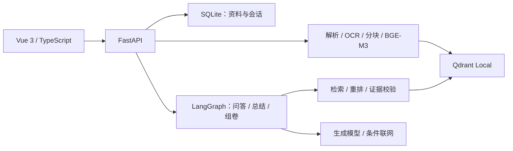

# Agentic：基于 RAG 的通用智能体实验平台

**简体中文** | [English](README.en.md)

> **GitHub 仓库**：[SevChu/RAG-Agent](https://github.com/SevChu/RAG-Agent)（公开可见、非开源）
>
> **About**：基于 FastAPI、Vue 3、LangGraph、BGE-M3、Qdrant 与多模型 OpenAI 兼容接口构建的本地优先 RAG Agent 实验平台；目标是通过可追溯知识检索、模型微调与评测/评分算法优化，打造较为通用且回答质量较高的 Agent。
>
> **许可**：Copyright © 2026 Severus Chu。All rights reserved. 专有许可只覆盖 Severus Chu
> 拥有版权的 Agentic 原创材料；第三方依赖、模型与 Benchmark 不在该版权主张范围内，分别
> 遵循其上游条款。详见 [LICENSE](LICENSE) 与 [THIRD_PARTY_NOTICES](THIRD_PARTY_NOTICES.md)。

> **当前版本：v1.2.2** — 暖白编辑风格改版，保留现有功能与布局。详见[版本说明](docs/releases/v1.2.2.md)。

> 历史版本 `v1.2.1` 公开 Week 6 Extra 的负向证据：最终拒绝
> Day 2 检索候选、延后 Day 3 Completeness 候选，两者均不进入 profile。已发布的 NLI
> offline/advisory span profile 保持不变。

> **语言边界**：当前版本的程序界面、提示词和面向用户的错误信息仅支持中文。英文 README
> 用于帮助国际读者了解项目，不代表程序已经完成英文支持；产品级中英文切换计划纳入未来
> `v1.6.0` 国际化里程碑。

## 快速上手（新手版）

> 本节适用于获得作者授权的本地运行。第一次使用不需要先读完整技术文档：准备一个可用模型
> API、确认本地检索模型目录存在，再分别启动后端和前端即可。

### 1. 准备基础环境

建议使用 Windows 10/11，并提前安装：

- [Git](https://git-scm.com/)；
- [uv](https://docs.astral.sh/uv/)；
- Node.js 24 或兼容版本（自带 npm）；
- NVIDIA GPU 为推荐项，CPU 也可运行部分流程，但文档索引和本地模型推理会明显更慢。

如果已经拿到完整项目文件夹，可以直接进入项目根目录；如果是经授权从 GitHub 获取：

```powershell
git clone https://github.com/SevChu/RAG-Agent.git
cd RAG-Agent
```

### 2. 创建配置文件并填写一个模型

在项目根目录执行：

```powershell
Copy-Item .env.example .env
notepad .env
```

只想先跑通程序时，至少配置一个供应商。以 DeepSeek 为例：

```dotenv
LLM_BASE_URL=https://api.deepseek.com
LLM_API_KEY=替换为你自己的APIKey
LLM_MODEL=替换为你的实际模型ID
LLM_AVAILABLE_MODELS=替换为你的实际模型ID
```

模型 ID 必须以供应商控制台当前提供的名称为准。不要把 `.env`、API Key 或真实模型凭据提交
到 Git。若使用 Qwen、Kimi 或 GLM，则填写 `.env` 中对应的 `*_API_KEY` 和 `*_MODELS`；两项
都填写后，该供应商才会在程序中显示为可用。

### 3. 确认本地检索模型

模型权重不随 GitHub 仓库分发，程序也不会自动下载。全新环境至少要准备：

| 用途 | 模型 | 默认目录 |
|---|---|---|
| 文档向量与检索 | `BAAI/bge-m3` | `data/models/embedding/bge-m3/` |
| 检索重排 | `BAAI/bge-reranker-v2-m3` | `data/models/reranker/bge-reranker-v2-m3/` |
| 扫描 PDF OCR | PaddleOCR 本地模型 | `data/models/paddleocr/` |

如果暂时只处理带原生文本层的文档，OCR 可以稍后准备；Embedding 和 Reranker 是完整 RAG
流程的必要条件。下载或复制模型前请确认来源、许可、版本、体积和哈希，然后在 `.env` 中按
实际位置修改 `EMBEDDING_MODEL_PATH`、`RERANKER_MODEL_PATH` 和 `PADDLE_OCR_BASE_DIR`。

### 4. 启动后端

打开第一个 PowerShell 窗口，在项目根目录执行：

```powershell
cd backend
uv sync --frozen
uv run alembic upgrade head
uv run python -m uvicorn app.main:app --reload --host 127.0.0.1 --port 8000
```

第一次执行 `uv sync --frozen` 会安装后端依赖，耗时取决于网络和硬件。看到 Uvicorn 已监听
`http://127.0.0.1:8000` 后，不要关闭这个窗口。

### 5. 启动前端

再打开一个 PowerShell 窗口，在项目根目录执行：

```powershell
cd frontend
npm install
npm.cmd run dev -- --host 127.0.0.1
```

然后用浏览器打开：

- 程序界面：`http://127.0.0.1:5173/`
- 后端健康检查：`http://127.0.0.1:8000/api/health`
- API 文档：`http://127.0.0.1:8000/docs`

### 6. 完成第一次问答

1. 打开“设置”，确认目标供应商显示为“已配置”；
2. 进入“资料空间”，创建一个空间；
3. 上传 PDF、PPTX、DOCX、Markdown 或 TXT 文件；
4. 等待资料状态变为“已完成”；
5. 进入“智能体对话”，选择刚才的资料空间并提问；
6. 检查回答是否带有文件名、页码、幻灯片或章节引用。

### 常见启动问题

| 现象 | 优先检查 |
|---|---|
| `uv` 或 `npm` 命令不存在 | 是否正确安装并重启终端 |
| 后端提示模型目录不存在 | 三个本地模型路径是否与 `.env` 一致 |
| 设置页显示“待配置” | Key 和模型列表是否同时填写；修改后是否重启后端 |
| 无法连接模型服务 | Base URL、模型 ID、Key、账户额度和本地网络 |
| 8000 或 5173 端口被占用 | 是否有上一次启动的后端或前端进程未关闭 |
| 扫描 PDF 无法解析 | PaddleOCR 模型目录是否存在；可先用 TXT/Markdown 验证主流程 |

仍无法启动时，按[运行与排障](docs/technical/operations.md)的检查顺序处理；所有环境变量见
[配置参考](docs/technical/configuration.md)。

## 项目能力与边界

Agentic 是一个本地优先、资料可追溯的通用智能体实验平台。上传资料后，系统通过解析、
结构化分块、向量检索与重排，为问答、总结和内容生成提供可引用的证据。

| 能力 | 当前实现 |
|---|---|
| 资料空间 | 创建相互隔离的空间，上传 PDF、PPTX、DOCX、Markdown、TXT；查看索引状态、重试及删除 |
| 资料问答 | Dense 检索与 Reranker、查询改写、资料不足拒答、文件/章节/页码引用 |
| 智能体任务 | 自动路由问答、动态总结和混合组卷；保留学习辅导与组卷能力模板 |
| 外部补充 | 条件触发 DeepSeek Web Search，区分 `[课n]` 与 `[外n]` 引用 |
| 会话 | 独立的快速对话与资料空间对话、历史恢复、多轮上下文和 SSE |
| 模型配置 | DeepSeek、Qwen、Kimi、GLM 的 OpenAI-compatible 接口，服务端白名单与 Token 统计 |
| 研究评测 | FiQA、RAGTruth、RAGBench 的冻结基线、候选实验及聚合结果 |

当前为本地单用户应用，程序界面、提示词和用户错误信息仅支持中文。账号权限、资料共享、
微调界面、跨会话长期记忆和产品国际化属于后续路线；当前不执行用户上传或模型生成的代码。

## 技术架构



后端使用 Python、FastAPI、SQLAlchemy、LangGraph、Qdrant Client 和本地检索模型；
前端使用 Vue 3、TypeScript、Pinia 和 Element Plus。运行依赖以
[后端配置](backend/pyproject.toml)、[后端锁文件](backend/uv.lock)及
[前端配置](frontend/package.json)为准。组件职责、信任边界和存储一致性见
[系统架构](docs/technical/architecture.md)。

## 配置、评测与研发路线

- 配置从 [.env.example](.env.example) 创建，完整字段见[配置参考](docs/technical/configuration.md)。
  每个供应商需同时配置 Key 与模型白名单；修改 `.env` 后重启后端。
- 资料、数据库、向量库和模型保存在本地并排除出 Git。生成和联网请求会将必要问题与证据发送给
  相应供应商；具体数据边界见[运行与排障](docs/technical/operations.md)。
- 实验须保留配置、数据版本、质量指标、延迟和资源统计；训练、验证与测试集保持隔离。
  冻结 profile 与复现方法见[公开 Benchmark 与冻结基线](docs/technical/evaluation-and-baselines.md)。
- `v1.2.1` 的 Week 6 Extra 未新增 profile；既有 NLI offline/advisory span profile 保持不变。
  结果见 [v1.2.1 聚合报告](benchmarks/v1.2.1/README.md)及[发布说明](docs/releases/v1.2.1.md)。
- 后续依次建设 AgentProfile、多智能体配置、微调基础、真实微调、长上下文、资料空间记忆、
  人工金标工具与中英文支持。版本范围以[研发路线](docs/deliverables/week-06-to-11-roadmap.md)为准。

## 开发与文档导航

| 需要了解 | 入口 |
|---|---|
| 当前实现与文档地图 | [技术文档索引](docs/technical/README.md) |
| 安装、备份、恢复和故障处理 | [运行与排障](docs/technical/operations.md) |
| API 路径、请求结构与 SSE | [API 参考](docs/technical/api-reference.md) |
| 解析、索引、检索和引用 | [资料与 RAG 管线](docs/technical/data-and-rag-pipeline.md) |
| 问答、总结、组卷及上下文 | [智能体与生成链路](docs/technical/agent-and-generation.md) |
| 测试、构建与贡献规则 | [开发与测试](docs/technical/development-and-testing.md)、[参与开发](CONTRIBUTING.md) |
| 存储构成与清理记录 | [存储与代码审计](docs/technical/storage-and-code-audit-2026-09-07.md) |
| 逐周进度、验收与设计决策 | [工程日志索引](docs/engineering-logs/README.md) |
| 发布历史 | [CHANGELOG](CHANGELOG.md) |
| 授权与第三方材料 | [LICENSE](LICENSE)、[THIRD_PARTY_NOTICES](THIRD_PARTY_NOTICES.md) |

README 维护上手步骤、能力摘要和导航；配置、API、开发规范及历史验收分别在对应文档中维护。
早期草案可通过 README 的 Git 历史追溯，实际实施记录以工程日志及其关联验收文档为准。
