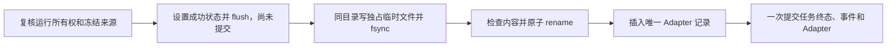

# 模拟 Adapter Registry 与文件/数据库一致性

> v1.4.0-beta.1 候选当前态：数据、任务、模拟产物和五步界面均已实现并验收；正式 09 迁移与 worker
> 已获准完成。下文按日期保留设计演进；早期“尚未实现/未升级”仅表示当日状态。
> 本候选仍只含 FakeTrainer，没有真实权重、真实评测或在线绑定。当前维护入口见
> [训练平台](../technical/training-platform.md)，发布等待[文档审阅](../releases/v1.4.0-beta.1-approval.md)。

- 日期：2026-09-11，第八周 Day 3。
- 前置：[数据 Registry](training-dataset-registry.md)、[任务生命周期](training-run-lifecycle.md)。
- 本周只产生模拟 manifest；没有权重、真实评测、运行绑定或训练质量结论。

## 身份与来源

`model_adapters` 通过唯一 run_id 关联 TrainingRun，自引用 predecessor_id 固定前驱。ID 为基于 run UUID 的确定性 UUIDv5；同一任务重复回调或补登记只会得到同一个 ID。数据库外键、唯一约束和四个触发器保护不可变身份、禁止替换/删除、只准成功模拟任务登记。唯一可变字段为 archived_at，只允许首次逻辑归档，重复归档由服务幂等处理。

manifest 固定 adapter/run/predecessor ID、原任务快照 SHA-256、完成时间、数据 schema version、Registry version 和模拟结果。source 保留智能体/revision/config hash、数据 revision/manifest/content/split hash、审核序号、模型/目标、参数/seed、代码身份及 Python 版本；不包含系统提示正文、训练样本、worker token 或幂等键。

产物 manifest 的 SHA-256 独立保存，任务快照哈希继续指向原来源。registered created_at 与 run finished_at 分开：补登记时间不伪装成训练完成时间。模拟 checksum 用 Day 2 相同算法重新计算并验证，不接受任意自称成功的描述。

## 完成事务

上述操作都在同一个 SQLite BEGIN IMMEDIATE 写事务内，完成后才释放 worker 租约。其他本应用写入者不能同时登记或覆盖同一 ID。文件为 `TRAINING_DATA_DIR/adapters/<uuidhex>.json`，最大 128 KiB；临时文件为同目录独占 UUID 名称。拒绝符号链接/重解析点、非普通文件和多硬链接。外部调用不能传服务端路径或文件名。

此流程不能提供跨文件系统/数据库的原子事务。文件落盘后提交失败时，数据库事务回滚，不留下成功状态或 Adapter 记录；文件可能残留。worker 将仍有所有权的任务记为 failed，若进程同时退出，则沿用租约过期恢复。文件写入/rename 失败可能留下临时文件，核对接口报告数量。本周不自动清理、硬删除或覆盖残留文件。

rename 在本应用串行写事务和受控目录约束下使用；同一操作系统账户的恶意并发替换、底层文件系统异常和断电后目录元数据持久性不在本次证明范围内。fsync 文件与原子 rename 不等于完整灾备或断电保证。

## 补登记与失效

POST `/api/model-adapters/from-run/{run_id}` 只处理已 succeeded 的任务。它校验原任务快照及确定性结果，重建同一 manifest，然后：

- 无登记/无文件：生成 manifest 并登记，用于 Day 2 历史成功任务。
- 无登记/文件完全匹配：复用文件，补齐数据库引用，适用于登记事务失败后的成功历史任务。
- 已登记且文件有效：幂等返回原记录，包括已归档记录。
- 已登记但文件缺失、文件被改写或内容不匹配：明确拒绝自动覆盖/修复。
- failed/cancelled/interrupted/queued/running：拒绝登记；残留文件不构成成功证明。

补登记不重新训练、不重写成功任务、不按当前模型代码重新生成结果，也不要求已结束任务的数据重新获批。它保留原审核序号和代码哈希；数据撤销、智能体删除后的历史仍可追溯。Day 2 旧快照缺少 predecessor_adapter_id 时按 None 解释，不重算旧快照哈希。仍在排队的旧代码任务继续受原有启动前 code_identity 复核约束，不自动迁移运行配置。

详情/列表返回 integrity=valid/missing/invalid。此状态针对 Registry manifest 文件；不是重新验证全部原始数据可用或来源仍获授权。模拟 Adapter 始终 deployable=false、evaluation_status=not_evaluated。

GET storage-audit 最多扫描 5000 个目录条目，只返回规范 UUID 文件中缺少数据库引用的 ID、暂存/未知条目计数；分页 limit 为 1～100，超限明确 scan_truncated。该接口是有界核对，不在大目录或并发文件变化下声称完整稳定快照。已登记文件的缺失/损坏通过详情/列表检查。

## 前驱、兼容与运行隔离

创建任务时可指定 predecessor_adapter_id，校验同一智能体、目标、base model/revision，前驱未归档且文件有效；在运行前/完成前复查。前驱必须先存在，身份不能后改，因此正常写入不能构成环。此字段只记录来源关系，不加载前驱权重或续训，不自动绑定智能体。来源查询沿前驱分页返回，并允许读取已归档历史。

兼容检查比较 target、base model/revision、数据 schema、完整 LoRA/QLoRA 参数、文件完整性和归档状态。即使 contract_compatible=true，也始终返回 SIMULATED_NOT_DEPLOYABLE / NOT_EVALUATED 和 deployable=false；参数匹配不证明硬件支持或模型质量。

本周没有激活 Adapter 到运行环境的接口。现有 AgentConfiguration 在根、model、retrieval 配置中都拒绝未知 adapter_id 字段；不新增运行默认项、不更改旧 revision/config hash 或会话绑定。产品源码包排除 app/training，保留共享 ModelAdapter 模型和冻结迁移 `20260911_09`。

## 第九周预留

真实产物需另行定义权重文件清单/哈希、基础模型精确版本及训练环境；冻结 base 对照、validation 指标与晋级门，获批后一次 test。只有真实产物且评测合格，才可通过新的显式后端授权路径生成指定智能体的新 revision。运行绑定及回滚需要验证模型实际切换，不能通过改本周 simulated 标识实现晋级。

当前数据库约束刻意只接受 simulated/not_evaluated，不把真实训练或部署能力预先开放；接入真实 Trainer 时需明确迁移和评测协议。
