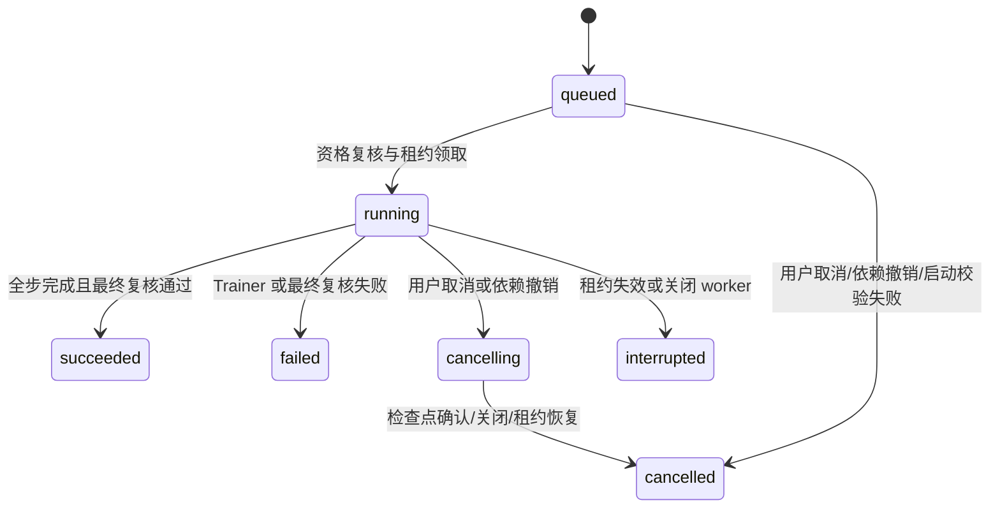

# 模拟训练任务：状态机、租约与取消一致性

> v1.4.0-beta.1 候选当前态：数据、任务、模拟产物和五步界面均已实现并验收；正式 09 迁移与 worker
> 已获准完成。下文按日期保留设计演进；早期“尚未实现/未升级”仅表示当日状态。
> 本候选仍只含 FakeTrainer，没有真实权重、真实评测或在线绑定。当前维护入口见
> [训练平台](../technical/training-platform.md)，发布等待[文档审阅](../releases/v1.4.0-beta.1-approval.md)。

- 日期：2026-09-11；第八周 Day 2。
- 依据：[周计划](../deliverables/week-08-plan.md)、[数据 Registry 契约](training-dataset-registry.md)。
- 仅 Fake Trainer；没有真实训练栈、模型下载、Adapter Registry 或在线运行绑定。

## 数据模型和固定身份

新增 `20260911_08`，父版本为 `20260911_07`：

| 表 | 职责 |
|---|---|
| training_runs | 不可变任务来源/请求指纹及可变状态、进度、所有权、起止时间、模拟结果 |
| training_events | 按 run_id + sequence 追加的阶段、错误码/事件码、完成步数、总步数、时间 |
| training_worker_leases | id=1 的单例租约，保存随机 owner_token 与 expires_at |

快照固定提交时的 AgentProfile revision、配置 JSON/hash、DatasetRevision、manifest/content/split hash、审核序号、训练目标、模拟 base model/revision、LoRA/QLoRA 参数、seed、模拟步数、代码哈希和 Python 版本。生成模型路由不是训练 base model；来源配置只用于追溯与权限，Fake Trainer 不调用生成供应商。

代码身份为 `app/training/*.py` 及三个训练 ORM 文件（training_dataset、training_run、model_adapter）的内容摘要，含校验器和 Trainer；它不是 Git commit 或完整依赖环境快照。运行前/完成前如果代码身份已变化，旧任务不会静默在新实现上成功；重试新建任务时记录当前代码身份。

快照 SHA-256 包含幂等键等身份字段，因此不同任务的快照哈希可以不同；模拟结果 checksum 只依赖 seed、参数、数据哈希、模拟 base model 和步数，不含时间或 run ID。同等输入不等于真实模型质量相同。

## 状态机与持久化事件

- 数据库触发器保护来源快照、请求指纹、来源外键、总步数等身份，阻止原地修改/删除/REPLACE。
- 合法迁移、进度不倒退、成功时完成全部步数和终态不可再修改同时有数据库约束。
- 入队和状态/进度变更在同一事务中由触发器追加事件，避免状态已变而日志缺失。
- 进度回调每次最多增加一步；重复同一步是幂等无操作。模拟步数限制 1～100，单任务最多 104 条状态/进度事件；心跳只改租约，不产生无界日志。
- 事件和任务历史保留，不自动删除；事件 API 使用 after 序号和 limit 1～100 分页。重试是新任务，不清空失败记录。
- 日志仅写固定事件/错误码，不附原异常文本、系统提示、样本、凭据或内部绝对路径。详情以字段白名单返回来源摘要，不返回冻结系统提示和 owner_token。

## 幂等提交与重试

提交、取消、重试、领取、进度、完成、心跳均使用独立 session 和 SQLite `BEGIN IMMEDIATE` 写事务。任务提交的资格校验因此与数据审核和智能体修改串行提交。

idempotency_key 全局唯一；规范请求 + retry_of 计算 request_sha256。同键同参返回原任务，同键异参返回 409。幂等重放不新建任务，也不要求一个已经完成的旧请求再次获准执行。

仅 failed/cancelled/interrupted 可以重试。新任务保留原数据版本、参数及原 AgentProfile revision，重新验证当前审核与空间权限，记录新的审核序号/代码身份；不能以重试绕过撤销。原 run 和事件不变，retry_of 指向原记录；成功任务不能重试。

## 单 worker 租约与恢复

1. worker 领取全局单例租约，生成随机 token；同一事务固定 run.owner_token、running 状态与初始事件。未过期租约存在时其他 worker 不领取任务。
2. 默认租约 10 秒；心跳周期为租约的 1/3，进度回调也续约。每次回调都验证 run token、租约 token、有效期与状态。
3. 无租约或租约过期才恢复遗留 running/cancelling：分别标记 interrupted/cancelled，追加 WORKER_LOST，再处理排队任务。不在启动时盲目中断仍有有效租约的其他进程。
4. 丢失租约的旧 worker 不能续约、更新进度或提交结果，即使其迟到回调仍到达。
5. 应用正常关闭取消后台协程，通常主动将所属任务记为 interrupted（已在取消中则 cancelled）。若已失去所有权或数据库暂不可写，后续通过租约恢复处理，不能伪造终态。
6. 页面刷新只重新读取持久化任务，不启动第二次执行。中断不会自动续训，用户显式重试新建 run。

这是单机 SQLite 的持久化调度和写入防护，未提供分布式调度、真实 checkpoint 续训或 GPU 子进程强杀。失去租约的 Fake worker 在下一检查点停止，不能把此机制直接当作真实训练进程已被杀死的证明。第九周接入真实 Trainer 时必须另行验证资源释放与中止机制。

## 撤销与完成的竞争规则

新增数据库触发器，使以下操作与任务取消在同一事务提交，无须由产品模式导入 Python 训练模块：

- 审核状态变为非 approved：相关 queued → cancelled，running → cancelling。
- 智能体停用/逻辑删除：同上。
- 新 AgentProfile revision 收窄来源空间：仅取消受影响数据范围的任务。
- 来源资料空间删除：取消引用该空间的任务。

任务取消后重新批准数据、启用智能体或扩大权限均不使原任务复活。重新运行需要新任务/重试，并通过资格门。

完成时重新核验数据文件、内容/manifest/split 哈希、当前审核、原/当前智能体范围与代码身份。取消或撤销先提交，完成逻辑只能确认 cancelled；成功先提交，后续取消保留 succeeded 历史。不能承诺“完成后收到取消也算取消”，也不能让迟到回调覆盖取消终态。

每次完整资格复核在写事务内执行，可能延长其他写操作等待；这是本地有界 Fake 流程的取舍，不代表可扩展到大规模真实训练。文件改动不受数据库事务锁保护，启动和完成均复核，但不宣称防御同一 OS 账户持续篡改文件的攻击者。

## Trainer 与资源语义

Trainer 协议提供异步 run、进度/取消回调、estimate；FakeTrainer 通过受控步间隔推进，故障注入仅由测试构造器提供，HTTP 不接受 fail_at、任意 Trainer、脚本或模型路径。

HTTP 只接受 fake-v1，以及匹配目标的 fake-scorer-v1/fake-reranker-v1（revision=fake-1）。LoRA/QLoRA 参数经范围检查后保存，不会安装量化库或证明真实硬件兼容。

默认模拟 20 步、每步 0.2 秒；步数是平台演练参数，与真实 epoch/batch 的训练步数无等价关系。估算只包含步骤名义耗时和可用 RAM，真实显存、训练时间及外部成本均为 null（待评估）。不含排队、数据库或校验开销；运行环境和管理员设置不是资源保证。

成功结果仅保存 simulated/deployable=false/not_evaluated 与确定性 checksum，没有权重文件、质量指标或已登记 Adapter。Day 3 将在此结果协议上设计 Registry 和文件产物一致性；Day 2 不冒充已交付 Adapter。

## 启用和分发边界

`TRAINING_WORKER_ENABLED=false` 为默认值。仅 research 模式且显式启用时，应用 lifespan 才启动 worker；关闭时停止 worker。options.worker_enabled 反映配置，不是活性探针。科研模式 API 可先创建排队任务，后台未启用时不会执行。

产品源码包继续排除 `app/training`，保留共用模型、迁移和纯 SQL 取消规则；产品 API 不注册训练路由。完整开发仓库的 product 模式返回 403。普通生成路径不增加 Trainer 调用、重复模型加载或 Benchmark 请求。

本轮只在隔离数据库开发/验收，正式库/.env 未更改，未启用正式后台。正式试用需先审查数据库备份、Day 1/2 迁移与开关变更；新增依赖/模型/数据、真实训练和发布仍须具体审查。

## 2026-09-11 Day 3 增补

成功终态现在与唯一模拟 Adapter 记录同事务提交；创建请求可选兼容前驱，文件与数据库失败语义及历史补登记见[产物一致性设计](simulated-adapter-registry.md)。本节之前记录 Day 2 契约，新增能力仍不开放真实训练或运行绑定。
