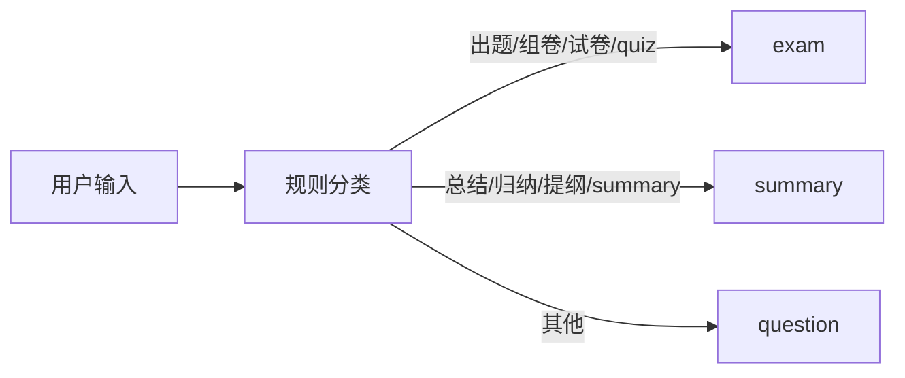

# 智能体与生成链路

## 1. 两种对话模式

| 模式 | 资料空间 | 历史 | Web Search | 任务路由 |
|---|---|---|---|---|
| 智能体对话 | 必须绑定一个资料空间 | 最近完成消息，默认最多 6 条/6000 字符 | 普通问答和组卷可条件触发；总结禁用 | question / summary / exam |
| 快速对话 | 不访问资料空间 | 最近完成消息，默认最多 10 条/8000 字符 | 默认允许规则触发，可逐轮关闭 | 通用文本回答 |

两类会话在数据库中通过 `Conversation.kind` 区分，不共享历史。空间对话随资料空间级联删除；快速对话独立存在。

## 2. 资料空间任务路由

`RequestRoutingGraph` 使用 LangGraph 表达状态转移，但分类本身是可测试的正则与关键词规则，不会增加一次模型调用。



### 2.1 普通问答 `question`

默认路径。处理事实解释、资料比较、信息提取和没有明确总结/组卷动作的内容生成请求。

### 2.2 资料总结 `summary`

识别中文总结动作、复习提纲/知识框架/重点清单，以及英文 summary/study guide 等表达。系统也包含反例规则，避免把“什么是总结”误识别为生成总结。

范围解析：

- `documents`：API 显式传入 document IDs；
- `topic`：问题指定章节、知识点或 topic；
- `course`：明确要求整个空间/全部资料，或没有更小范围时的默认值。

### 2.3 组卷 `exam`

识别出题、组卷、试卷、题型与数量等动作；对“如何设计试卷”这类把组卷作为讨论对象的问题使用反例规则，仍按普通问答。

如果紧邻上一条已完成助手消息是试卷，后续“补充答案/解析”可以进入试卷输出续写，而不会重新把任意含“答案”字样的问题当作组卷。

## 3. 有限上下文与查询改写

生成前只读取当前会话最近的**已完成**消息，并同时施加消息数和字符数预算。这样避免：

- 把失败或中断内容当成可信历史；
- 对话无限增长导致上下文失控；
- 不同会话、不同资料空间相互污染。

对带指代、简称或省略的后续问题，Query Rewriter 基于有限历史生成独立检索查询。原始问题仍用于回答，改写查询、是否改写和使用的上下文条数会写入 retrieval 诊断。

1.0.0 没有长期记忆，也没有 100k 动态上下文。会话历史不是模型永久记忆，刷新后由 SQLite 恢复已保存消息。

## 4. 普通问答

### 4.1 回答范围

| `answer_scope` | 行为 |
|---|---|
| `course_only` | 只允许当前空间资料，强制关闭 Web Search |
| `course_and_external` | 先检索空间资料，再按覆盖情况决定是否联网 |

### 4.2 覆盖与联网决策

`ConditionalAnswerGraph` 包含三个节点：

1. `assess_coverage`
2. `search_external`（可跳过）
3. `generate_answer`

以下情况会优先触发外部搜索：

- 用户明确要求外部、联网、官方文档、论文或最新研究；
- 问题具有明显时效性；
- 没有达到最低证据阈值的空间资料；
- 最高证据分数低于外部触发阈值；
- 多部分问题的资料覆盖不足。

以下情况不会搜索：

- `course_only`；
- 服务端关闭 `EXTERNAL_SEARCH_ENABLED`；
- 空间资料已经提供足够覆盖，且问题没有显式外部或时效要求。

搜索失败时：

- 若仍有可用空间证据，降级为空间资料回答并标记 `fallback_applied`；
- 没有合格证据时，生成器必须明确资料不足，而不是伪造来源。

### 4.3 生成约束

- 资料内容被包裹为证据，不作为系统指令执行。
- 结论必须使用提供的来源编号。
- 题干和未知角色不能支撑事实结论。
- 资料与外部来源冲突时要显式提示，不把两者混成一个无来源判断。
- 无足够证据时返回 `insufficient_evidence`。
- 回答风格可选 `concise`、`balanced`、`detailed`。

## 5. Web Search 适配器

当前适配器使用 DeepSeek 的服务端 Web Search 工具，而非通用搜索引擎 SDK。

处理步骤：

1. 选择 DeepSeek 搜索模型。
2. 发送归一化查询和工具调用上限。
3. 解析上游结果与 usage。
4. 规范化 URL，移除常见跟踪参数。
5. 排除不允许的社区/内容农场主机。
6. 去重并限制结果数。
7. 按 academic、institutional、official、professional 分级排序。
8. 返回标题、发布者、URL、摘要、访问时间和质量级别。

显式排除列表当前包括 CSDN、Facebook、Medium、Quora、Reddit、微博、X 和知乎等主机。来源分级只是启发式质量信号，不等同于内容真实性保证。

搜索与最终生成可能使用不同模型：最终模型属于 Qwen/Kimi/GLM 时，搜索阶段仍使用 `EXTERNAL_SEARCH_MODEL` 或 DeepSeek 白名单第一项。

## 6. 快速对话

快速对话系统提示明确声明“不检索资料空间”。流程：

1. 读取有限 quick 历史。
2. 检查本轮 `web_search` 与服务端总开关。
3. 用确定性规则判断当前消息是否需要联网。
4. 必要时基于历史生成搜索查询。
5. 将合格外部证据与消息一起发送给生成模型。
6. 清洗回答中的外部引用编号。
7. 保存交换、usage、联网诊断和引用。

关闭联网后，回答只能依赖模型已有能力和当前有限历史。界面必须显示本轮是否联网、搜索状态和来源。

## 7. 动态资料总结

总结不是把所有召回片段一次性塞进普通问答提示，而是计划驱动的独立链路。

### 7.1 总结计划

系统根据请求和范围建立有界 `SummaryPlan`，决定分节目标和每节应覆盖的内容。未指定结构时使用综合总结计划；用户指定章节、主题或输出重点时生成动态计划。

### 7.2 证据获取

- 使用总结专用候选和 Top-K 参数；
- 扩展检索查询以覆盖核心概念、知识关系、常见错误、示例、应用、复习建议和重点；
- 对每节选择证据并遵守总来源数和字符预算；
- 总结始终限定空间资料，不使用 Web Search。

### 7.3 生成与校验

- 按计划逐节生成结构化 JSON；
- 校验栏目、正文、来源编号和计划覆盖；
- 必要时进行一次修复调用；
- 对资料不足的分节显式标记；
- 输出总结计划与质量诊断，持久化在 retrieval JSON 中。

质量诊断包括计划覆盖、引用有效性、修复情况、被补全的引用标记和资料不足分节等信息。

## 8. 混合组卷

组卷链路先解析自然语言要求，再建立冻结的 `ExamPlan`。

### 8.1 计划维度

- 题目总数；
- 单选、多选、判断、简答、编程等题型配额；
- 难度配额；
- 编程语言；
- 是否包含答案；
- 是否包含解析；
- 来源范围与外部题目上限；
- 可直接改编空间资料题目的数量上限。

### 8.2 生成策略

- 使用组卷专用检索和上下文预算。
- 题目分批生成，降低单次 JSON 和上下文压力。
- 用户未要求答案/解析时，最终渲染严格隐藏这些部分。
- 编程题可以包含题意、输入输出、约束、样例、参考代码、复杂度和测试设计，但不执行代码。
- 混合来源时，外部补充最多占整卷 20%；搜索失败可降级为仅空间资料。
- 从空间资料直接采用或轻改的现成题目也受数量上限控制，避免整卷复制教材。

### 8.3 硬校验

完成前校验：

- 题目数与题型/难度配额；
- 每道题来源与引用编号；
- 答案和解析的证据资格；
- 外部题目比例；
- 直接采用空间资料题目比例；
- 重复题、格式和输出契约。

不满足硬约束时尝试受限修复；仍失败则返回 `LLM_OUTPUT_ERROR`，不会把不合格试卷作为成功结果持久化。

## 9. 多供应商生成客户端

生成模型通过模型白名单路由：

```text
requested model
→ provider_for_model
→ provider Base URL + API Key
→ POST /chat/completions
→ parse content/model/usage
→ record token event
```

当前支持：

- DeepSeek：现有主接口；发送 `thinking: disabled`；
- Qwen：OpenAI-compatible 预留/可配置接口；
- Kimi：OpenAI-compatible 预留/可配置接口；
- GLM：OpenAI-compatible 预留/可配置接口。

供应商“已配置”不代表模型一定可用，还取决于 Key 权限、模型 ID、地域、额度和供应商对 `response_format` 的兼容性。接入新模型后应至少验证普通文本、JSON 模式、错误映射、usage 和长输入行为。

## 10. 重试和错误语义

生成客户端对网络错误、超时、HTTP 429 和 5xx 最多重试一次。主要映射：

- 缺少 Key/白名单：`LLM_NOT_CONFIGURED`；
- 401：Key 无效；
- 429：请求过多或额度不足；
- 400 且包含上下文/长度信息：提示缩小总结范围；
- 其他上游错误：`LLM_SERVICE_ERROR`；
- 响应 JSON、内容或任务契约失败：`LLM_OUTPUT_ERROR`。

自动重试可能增加实际 Token 与费用；Token 累计按每个成功返回 usage 的上游响应记录，而不是只统计最终答案。

## 11. Token 统计

每个模型事件记录：

- 输入缓存命中 Token；
- 输入缓存未命中 Token；
- 输出 Token；
- 模型名与创建时间。

若供应商只返回 `prompt_tokens` 而没有缓存拆分，系统把全部 prompt 计为缓存未命中。统计包括：

- 普通回答；
- 总结/组卷的计划、分批、修复调用；
- 快速对话；
- 外部搜索适配器返回的 usage。

因此页面累计值可能大于最终响应中显示的一次调用 usage，这是预期行为。

## 12. 安全边界

- 本地资料不会自动上传到第三方存储，但被选作生成证据的文本会发送给外部模型 API。
- 当前没有资料脱敏器、DLP 或敏感字段检测。
- Web Search 查询可能包含用户问题和有限上下文改写结果。
- 外部 URL 只作为引用展示；后端不把任意网页内容视为可信指令。
- 生成的代码不执行。
- 当前没有提示注入的形式化安全认证，只有证据包装、来源限制和内容角色门控。

## 13. 后续扩展点

### AgentProfile

未来应把系统提示、允许工具、资料空间、默认模型、上下文策略、评测套件和 Adapter 绑定到版本化 AgentProfile，而不是继续依赖一个全局设置页。

### 微调

逐智能体微调界面需要在 AgentProfile 和数据版本稳定后接入，至少包含数据选择、训练参数、LoRA/QLoRA 作业、日志、指标、产物注册和回滚。1.0.0 不包含任何训练实现。

### 评分算法

后续先在获批公开 Benchmark 上冻结经典检索和回答评分器，再研究融合、校准和小模型微调。评分器结果必须与被测 Agent 输出分开持久化。
