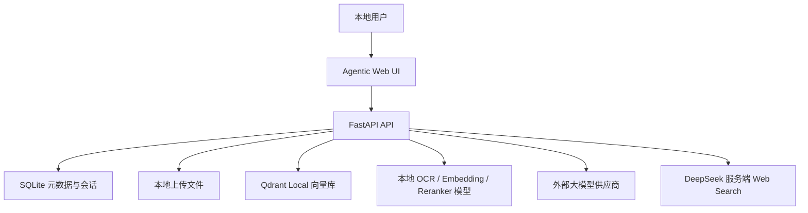
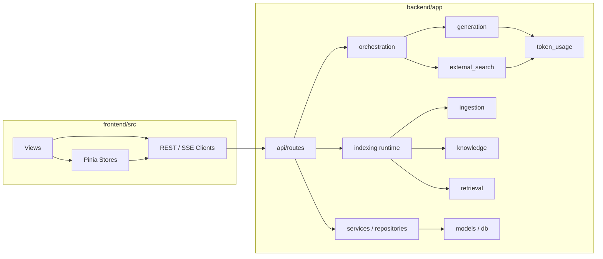
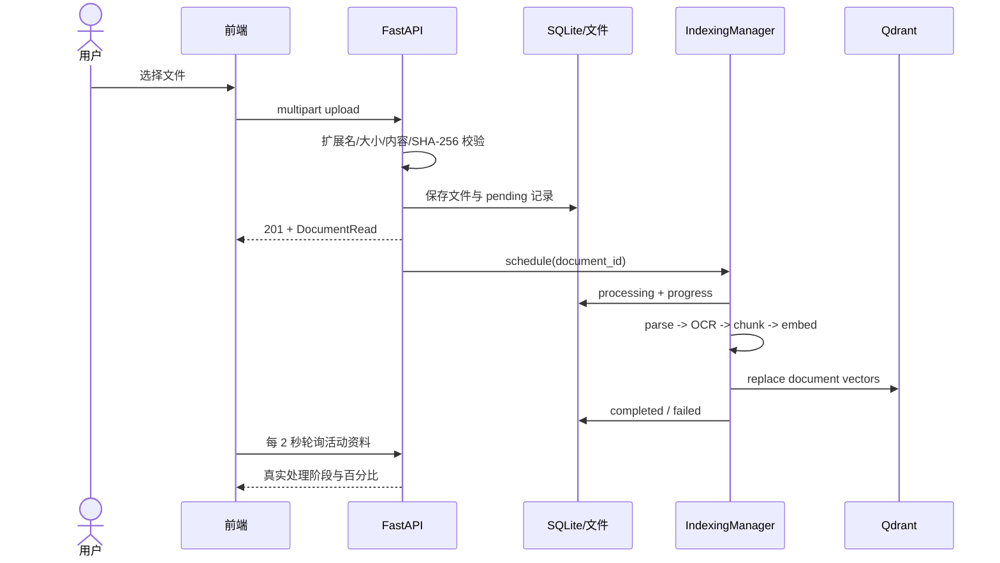
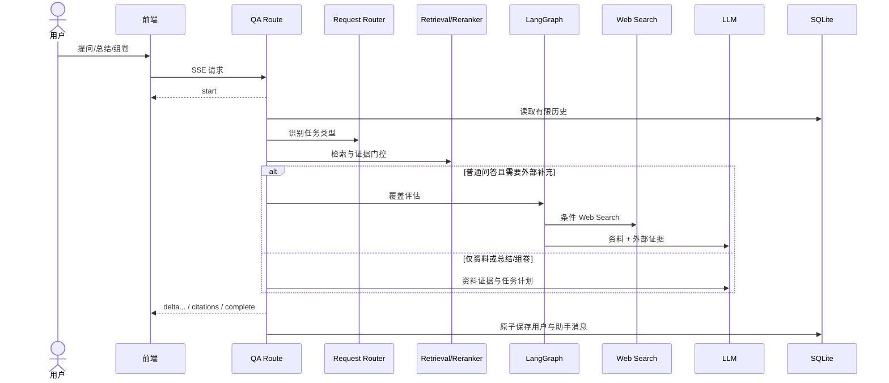

# 系统架构

## 1. 架构目标

Agentic 1.0.0 围绕四个目标组织：

1. **本地优先**：资料、元数据、向量和本地模型默认留在用户机器上。
2. **来源可追溯**：从解析块到最终引用保留文件、章节、页码、幻灯片和行号谱系。
3. **故障可恢复**：上传与索引解耦，索引失败可以重试，删除操作优先保护跨存储一致性。
4. **研究可扩展**：模型供应商、检索、重排、评分和未来微调保持相对独立的接口。

系统是单仓库、前后端分离、本地单用户应用。它不是微服务系统；当前无需独立部署数据库、Qdrant 服务或任务队列。

## 2. 系统上下文

信任边界：

- 浏览器、FastAPI、SQLite、Qdrant 和本地模型位于本机边界内。
- 生成请求会把系统提示、用户问题和必要的检索证据发送给选定的大模型供应商。
- 触发 Web Search 时，搜索查询会发送给 DeepSeek；搜索结果摘要由适配器清洗后进入生成链路。
- 当前没有身份认证和租户隔离，不能直接暴露到不可信网络。

## 3. 逻辑组件

### 3.1 前端

前端使用 Vue 3 Composition API 和 TypeScript：

- `views/`：资料空间列表、资料详情、智能体管理、智能体对话、快速对话和设置页。
- `components/AppSidebar.vue`：导航、两类会话历史、折叠与移动端入口。
- `stores/courses.ts`：资料空间和资料状态。
- `stores/conversations.ts`：快速对话与资料空间对话缓存。
- `stores/llm.ts`：后端模型配置、当前模型和供应商状态。
- `api/http.ts`、`api/client.ts`：Axios 基础配置、统一响应解包和中文错误映射。
- `api/stream.ts`：基于 `fetch-event-source` 的 SSE 消费、AbortSignal 和事件分发。
- `types/api.ts`：前后端 DTO 的 TypeScript 镜像。

页面路由：

| 路径 | 页面 | 作用 |
|---|---|---|
| `/courses` | `CourseSpaceView` | 资料空间列表与创建 |
| `/courses/:courseId` | `CourseDetailView` | 上传、状态、重试与删除资料 |
| `/chat/:conversationId?` | `QuickChatView` | 不使用资料空间的临时问答 |
| `/assistant/:conversationId?` | `StudyAssistantView` | 绑定资料空间的智能体对话 |
| `/settings` | `SettingsView` | 模型切换、供应商状态和 Token 统计 |

路由 URL 和部分组件文件名保留历史兼容命名，不影响用户可见的“资料空间/智能体对话”语义。

### 3.2 API 层

FastAPI 在 `/api` 下聚合六组路由：

- 资料空间：创建、列表、详情和级联删除；
- 资料：上传、列表、详情、处理状态、重新索引、单删和批删；
- 会话：快速对话和资料空间对话的创建、读取、列表和删除；
- 检索：资料空间范围内的 Dense 搜索接口；
- 问答：模型配置、同步回答、流式回答和快速对话流；
- Token：按模型汇总与清零。

API 采用统一 `{data, error}` 响应包。流式接口改用 SSE 的 `start`、`delta`、`citations`、`complete` 和 `error` 事件。

### 3.3 业务与持久化层

- `services/` 执行业务规则和跨仓储操作。
- `repositories/` 封装 SQLAlchemy 查询。
- `models/` 定义 SQLite ORM 模型。
- `schemas/` 定义输入输出 DTO。
- Alembic 迁移是数据库结构的唯一版本来源。

SQLite 中现有四类核心表：`courses`、`documents`、`conversations/messages`、`token_usage_events`。总结和试卷不使用独立 artifact 表，而是作为助手消息正文及其 retrieval JSON 诊断持久化。

### 3.4 入库与知识层

- `ingestion/parsers/`：五类文档解析与 PDF OCR 回退。
- `ingestion/chunking/`：结构感知、章节感知分块。
- `knowledge/embedding.py`：本地 BGE-M3 Dense Embedding。
- `knowledge/vector_store.py`：Qdrant Collection、Point 和 Payload。
- `retrieval/reranker.py`：本地 BGE Cross Encoder 与证据门控。
- `indexing/runtime.py`：后台索引调度、状态推进、恢复、搜索和清理。

### 3.5 智能体与生成层

- `orchestration/request_router.py`：不额外调用模型的规则路由，识别 question/summary/exam。
- `orchestration/qa_graph.py`：评估资料覆盖、决定是否联网、生成答案和降级。
- `generation/service.py`：资料约束问答和混合来源生成。
- `generation/summary.py`：动态总结计划、分节生成与质量诊断。
- `generation/exam.py`：组卷计划、分批生成、配额和引用硬校验。
- `generation/client.py`：多供应商 OpenAI-compatible Chat Completions。
- `external_search/client.py`：DeepSeek 服务端 Web Search、来源清洗与质量分级。

## 4. 关键运行流程

### 4.1 上传与自动索引

上传接口尽快返回，CPU/GPU 密集处理在进程内后台任务中串行执行。后端启动时会将遗留的 `pending/processing` 任务恢复到等待状态并继续处理。

### 4.2 资料空间问答

后端当前先完成上游模型响应，再把答案切成小段通过 SSE 发送；它提供流式交互体验，但不是上游模型原生 token streaming。客户端在完成前断开时，本轮交换不会持久化。

### 4.3 快速对话

快速对话与资料空间问答隔离：

- 不查询 Qdrant；
- 使用独立的 quick conversation；
- 保留有限完成消息历史；
- 默认允许规则判断是否联网；
- 联网证据与引用使用 `external_web` 检索诊断；
- 可以在单轮请求中关闭 Web Search。

### 4.4 删除一致性

SQLite、上传文件和 Qdrant 不共享事务。删除操作采用补偿式顺序：

1. 将本地文件或课程目录移动到临时回收位置；
2. 删除对应文档或课程范围的向量；
3. 删除 SQLite 记录并提交；
4. 完成临时文件清理；
5. 任一步失败时恢复已暂存文件，并保留数据库记录。

如果 Qdrant 无法安全清理，API 返回 `INDEX_STORAGE_ERROR`，不会继续删除 SQLite 记录和原文件。批量删除先验证所有 ID 都属于目标资料空间，因此不会出现部分成功。

## 5. 数据所有权与隔离

| 数据 | 主存储 | 隔离键 | 生命周期 |
|---|---|---|---|
| 资料空间 | SQLite `courses` | `id` | 删除时级联资料与对话 |
| 原始资料 | 本地 `uploads/<course_id>/` | `course_id` | 与 Document 同步删除 |
| 资料元数据 | SQLite `documents` | `course_id` | 跟踪状态、哈希和进度 |
| 文本向量 | Qdrant Collection | Payload `course_id` | 重索引替换，删除时过滤清理 |
| 对话与消息 | SQLite | conversation/course | 快速对话与空间对话分开 |
| Token 事件 | SQLite | `model` | 独立累计，可整体清零 |
| 本地模型 | `data/models/` | 路径 | 不由应用自动下载或升级 |

同一内容可以进入不同资料空间；同一资料空间内通过 `(course_id, sha256)` 阻止重复。

## 6. 进程与并发模型

- FastAPI 使用异步 API 和异步 SQLAlchemy。
- 文档解析、Embedding、Qdrant 和 Reranker 等同步重任务通过线程切换执行。
- 当前索引管理器位于单个后端进程内，适合本地单进程运行。
- 不建议使用多个 Uvicorn worker 共同访问同一 Qdrant Local 目录；文件锁和进程内任务状态不支持这种部署。
- 开发模式 `--reload` 只适合本地开发，生产化前需要引入独立 Qdrant 服务、任务队列和并发控制。

## 7. 设计原则与取舍

### 本地 Qdrant 而非远程服务

1.0.0 优先降低本地部署复杂度。代价是单机文件锁、扩展性和多 worker 能力有限。

### 规则路由而非额外分类模型

问答/总结/组卷路由使用可测试规则和 LangGraph 状态图，不额外消耗一次模型调用。代价是新表达方式需要通过回归样本扩充规则。

### 多供应商共用 OpenAI-compatible 接口

生成客户端保持小而透明，减少 SDK 绑定。代价是供应商私有能力只有显式适配后才能使用；当前 DeepSeek `thinking` 和 Web Search 是特例。

### 产品术语迁移与内部兼容分离

1.0.0 先完成用户界面和研究定位迁移，同时保留稳定的内部 `Course` 契约。这样降低迁移风险，但开发者必须理解两套术语映射。

## 8. 明确非目标

- 多用户身份与权限；
- 公网 SaaS 部署；
- 分布式索引和高可用存储；
- 自动执行生成代码；
- 自动下载未审批的数据集或模型；
- 1.0.0 内提供 AgentProfile、微调作业和 Adapter 管理界面。

### Week 7 Day 4：智能体管理界面

/agents 对应 AgentProfilesView，复用 /api/agent-profiles 的管理与版本契约。
ConversationAgentControl 在两类对话中解析身份和固定版本，控制模型、工具及可用空间展示；
服务端仍执行最终权限校验。过期响应隔离保护快速切换的历史会话，编辑冲突保留草稿。
页面入口与验证记录见 [Day 4 实施报告](../deliverables/week-07-day-04.md)。
