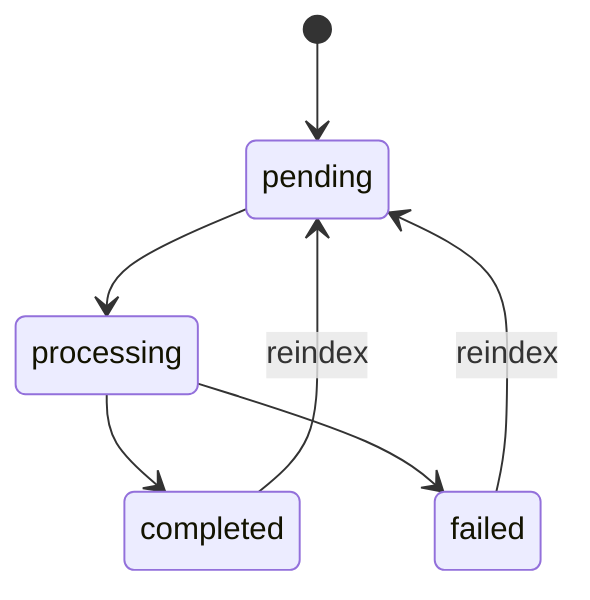

# 资料与 RAG 管线

## 1. 管线总览

```text
上传
→ 扩展名、大小、内容与 SHA-256 校验
→ 保存原文件和 Document(pending)
→ 后台解析（必要时逐页 OCR）
→ 章节/结构感知分块
→ 本地 BGE-M3 Embedding
→ Qdrant 替换式写入
→ Document(completed)
→ Dense 候选召回
→ BGE Reranker
→ 证据角色与概念门控
→ 进入问答、总结或组卷
```

资料入库与生成解耦：只有 `completed` 资料能够进入检索；`failed` 资料保留原文件和失败原因，可由用户重新处理。

## 2. 上传与校验

### 2.1 支持格式

| 格式 | 扩展名 | 主要解析策略 |
|---|---|---|
| PDF | `.pdf` | 逐页原生文本，空文本页按需 OCR |
| PowerPoint | `.pptx` | 安全读取 OOXML，按幻灯片和形状顺序提取 |
| Word | `.docx` | 安全读取 OOXML，提取标题、段落、列表和表格 |
| Markdown | `.md` | 标题、段落、列表、表格和 fenced code block |
| Text | `.txt` | UTF-8/UTF-8 BOM，按空行组织段落 |

### 2.2 文件级规则

- 默认单文件上限 100 MB，可通过 `MAX_UPLOAD_MB` 调整。
- 服务端按 1 MiB 流式读取，避免一次性把上传全部放入内存。
- 空文件拒绝。
- 只信扩展名是不够的：PDF 检查签名，DOCX/PPTX 检查 ZIP/OOXML 必需成员，文本检查编码和空字节。
- 存储文件名使用 Document UUID 与原扩展名，避免直接信任用户文件名。
- 在读取上传的同时计算 SHA-256。
- `(course_id, sha256)` 是数据库唯一约束；同内容可进入不同资料空间，但不能在同一空间重复。

## 3. 统一解析模型

所有解析器输出 `ParsedDocument`，核心由有序的 `ParsedBlock` 构成。每个块保留：

- 文本和结构类型；
- 章节路径；
- 原始块顺序；
- 源行号、PDF 页码或 PPTX 幻灯片编号；
- 提取方式，如原生 PDF 或 OCR；
- OCR 置信度和解析警告。

统一契约让后续 Chunker 不需要知道文件容器类型，同时使引用能够回到原始位置。

## 4. 各格式解析

### 4.1 TXT

- 接受 UTF-8 与 UTF-8 BOM。
- 保留原始行号和顺序。
- 以空行形成段落。
- 拒绝非法 UTF-8、空字节和无有效正文文件。

### 4.2 Markdown

- 识别多级标题并建立章节路径。
- 分离段落、列表、表格和 fenced code block。
- 代码块保留语言信息和源行号。
- 未闭合代码围栏形成显式警告，而不是静默丢弃内容。

### 4.3 DOCX

- 使用 Python 标准库读取 Office Open XML 容器，不依赖桌面 Office。
- 提取标题层级、段落、列表、表格、内容控件和图片占位。
- 对损坏容器、缺少必需成员、畸形 XML、加密文档和过大单 XML 成员进行保护性拒绝。
- 图片占位保留结构存在性，但 1.0.0 不执行图片语义理解。

### 4.4 PPTX

- 按演示顺序读取幻灯片。
- 提取标题、段落、列表、表格和图片占位。
- 每个块保留一基幻灯片编号。
- 以主标题形成章节路径，并对非标准封面形状做保守标题推断。
- 不承诺演讲者备注、SmartArt、复杂图表或图片内文字语义。

### 4.5 PDF 与 OCR

PDF 逐页处理：

1. 优先提取有效原生文本。
2. 只有无有效文本的页面才以 220 DPI 渲染并调用本地 PaddleOCR。
3. OCR 检测行按缩进、行距和版面区域重建为段落。
4. 基础表格、连续公式和代码尽量保留为受保护块。
5. 每个块保留一基页码、`native_pdf/ocr` 提取方式和最低 OCR 置信度。

混合 PDF 不会因为少数扫描页而对全文件执行 OCR。损坏或加密 PDF 被拒绝；空白页和低置信度结果产生可检查警告。

已知边界：复杂多栏、跨页/合并单元格表格、复杂数学公式、图示语义和低质量扫描仍可能影响顺序或内容准确性。

## 5. 结构化分块

### 5.1 默认参数

```text
target_tokens = 600
overlap_tokens = 80
```

Token 是轻量估算值，用于稳定切块，不等同于任一上游模型的精确 tokenizer 账单。

### 5.2 规则

- Chunk 携带章节标题上下文。
- 不跨章节或 PPTX 主标题合并。
- 列表项、表格和代码块视为受保护单元，不从中间随意拆分。
- 超长普通段落优先沿句末、换行和空白边界拆分。
- 重叠优先取完整尾句，避免让新 Chunk 从半句开始。
- 超长受保护单元允许超过目标长度，并产生警告。
- 每个 Chunk 至少引用一个源块；Chunk 序号从 0 连续递增。

### 5.3 Chunk 来源元数据

每个 Chunk 的 source 包含：

- `course_id`、`document_id`、文件名与类型；
- parser 名称与章节路径；
- 源块起止、源块列表和上下文块列表；
- block kinds；
- 行号、页码、幻灯片编号；
- 提取方式和最低 OCR 置信度。

这些字段进入 Qdrant Payload，并最终映射为用户可见引用。

## 6. Embedding

`BgeM3Embedder` 从本地 `BAAI/bge-m3` 目录加载模型：

- Dense 向量维度固定为 1024；
- 输出归一化向量；
- 支持批量编码；
- `auto` 模式优先 CUDA，失败时透明回退 CPU；
- 模型路径不存在时显式失败，不自动下载；
- 返回实际设备和回退原因供诊断。

Embedding 模型版本、维度和 Qdrant Collection 必须一起冻结。替换为不同维度的模型时，应使用新的 Collection 并全量重建索引。

## 7. Qdrant 数据

### 7.1 Collection

- 默认名称：`knowledge_chunks_v1`
- 向量大小：1024
- 距离：Cosine
- 模式：Qdrant Client Local Mode

应用首次使用时创建 Collection；如果已存在 Collection 的向量大小或距离不兼容，应用拒绝继续，防止把不同 Embedding 混入同一索引。

### 7.2 Point ID 与 Payload

Point ID 根据 `course_id:document_id:chunk_index` 确定性生成。Payload 至少包含：

```text
course_id, document_id, chunk_index, text
estimated_token_count, overlap_token_count
file_name, file_type, parser_name
section_path
source_block_start, source_block_end, source_block_indices
context_block_indices, block_kinds, content_role
line_start, line_end, page_numbers, slide_numbers
extraction_methods, minimum_ocr_confidence
```

搜索、替换和删除都必须携带 `course_id` 过滤。文档重新索引前删除旧 Point，再写入新 Point，确保结果不叠加。

## 8. 索引状态机

### 8.1 文档状态



### 8.2 处理阶段与进度

| 阶段 | 典型进度 | 内容 |
|---|---:|---|
| `waiting` | 0 | 等待后台任务 |
| `preparing` | 1 | 打开任务、核对文件 |
| `parsing` | 5～55 | 解析或逐页 OCR |
| `chunking` | 58～65 | 结构化分块 |
| `embedding` | 65～92 | 批量生成向量 |
| `storing` | 92～99 | 写入并确认 Qdrant |
| `completed` | 100 | 可检索 |
| `failed` | 保留最后值 | 清理部分向量并记录错误 |

前端对活动任务每 2 秒刷新。后端生命周期启动时，在 `AUTO_INDEX_DOCUMENTS=true` 的情况下恢复未完成任务。

失败处理会尝试清理该文档可能写入一半的向量，保留原文件，返回针对编码、PDF、OCR、模型缺失、文件缺失或存储异常的用户可理解说明。

## 9. 检索与重排

### 9.1 基础 Dense 检索

公开 `/retrieval/search`：

- 对查询生成 BGE-M3 向量；
- 限定 `course_id`；
- 可进一步限定 `document_ids`；
- 直接按 Cosine 分数返回 Top-K。

### 9.2 智能体内部检索

问答、总结和组卷使用更完整的流程：

1. 生成/改写检索查询。
2. Dense 召回较宽候选集。
3. BGE Reranker 计算 query-document 相关性。
4. 对内容角色执行证据资格判断。
5. 执行概念匹配和边界治理。
6. 返回任务配置的 Top-K 与诊断。

普通问答默认候选 20、最终 6；总结和组卷默认候选 40、最终 12。

## 10. 证据角色

系统用确定性规则给 Chunk 标记事实角色：

| 值 | 含义 | 普通事实证据资格 |
|---|---|---|
| `exposition` | 正文讲解 | 允许 |
| `example` | 示例/例题讲解 | 允许 |
| `exercise_question` | 未作答题干、选项或练习要求 | 拒绝 |
| `exercise_answer` | 答案或题解 | 允许 |
| `code` | 代码块 | 允许，但仍需概念匹配 |
| `unknown` | 无法可靠识别 | 保守拒绝 |

这一步将“主题相关”与“能够证明事实”分开，避免把题目中的错误选项当成答案依据。组卷可以利用题干作为任务素材，但题目答案和解析仍必须由具备事实资格的来源支撑。

## 11. 引用与来源谱系

资料引用把内部证据映射为：

- 检索排名和 Dense/Reranker 分数；
- 内容角色；
- 文件与类型；
- 章节路径；
- PDF 页码、PPTX 幻灯片或文本行号；
- 被使用的证据文本。

生成器只允许引用当前请求提供的来源编号。外部来源使用独立 source type 和编号空间，包含标题、发布者、URL 与访问时间。混合回答必须在界面上区分空间资料和外部资料。

## 12. 一致性审计

知识库审计工具同时检查 SQLite、上传目录和 Qdrant，可发现：

- 原文件缺失或大小不符；
- 上传目录孤儿文件；
- Qdrant 孤儿向量；
- 跨资料空间向量；
- 未完成资料残留向量；
- Chunk 序号断裂；
- PDF/PPTX 来源位置缺失。

本地运行：

```powershell
cd D:\Agentic\backend
.\.venv\Scripts\python.exe -m app.knowledge.audit
```

该命令可能读取整个正式知识库。发布文档或报告前检查输出是否包含用户资料原文。

## 13. 本地只读检查工具

解析与分块检查：

```powershell
cd D:\Agentic\backend
.\.venv\Scripts\python.exe -m app.ingestion.inspect `
  "D:\materials\sample.md" `
  --chunks `
  --max-chunks 10
```

本地 Embedding/Qdrant 抽查：

```powershell
.\.venv\Scripts\python.exe -m app.knowledge.inspect --help
```

先使用 `--help` 核对参数，并为抽查使用独立 Collection，避免把临时数据写入正式索引。

## 14. 已知限制与改进方向

- 当前召回只有 Dense 基线，BM25 与融合检索属于第五周后续计划。
- 本地 Qdrant 不适合多进程并发访问。
- 分块 Token 为估算值，不感知每个生成模型的真实 tokenizer。
- OCR 和结构解析无法保证复杂公式、图片和复杂表格语义完整。
- 内容角色是规则分类，需要用公开与自有数据持续评估误判。
- 重排与阈值改进必须在冻结 Benchmark 协议下报告质量、延迟和资源消耗。
